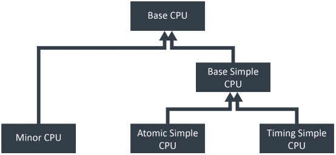
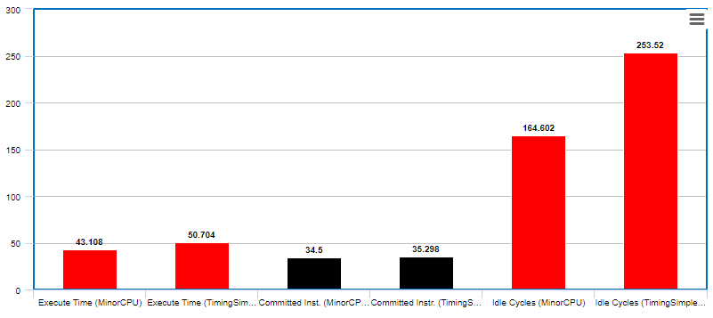

# Computer Architecture Lab 1

## Ομάδα 11
### Καλαντζής Γεώργιος 8818 gkalantz@ece.auth.gr
### Κοσέογλου Σωκράτης 8837 sokrkose@ece.auth.gr

Σκοπός της συγκεκριμένης εργασίας είναι μια πρώτη επαφή με τον _full-system simulator_ **gem5**, έτσι ώστε να κατανοήσουμε την αρχιτεκτονική αλλά και την λειτουργία ενός συστήματος. Στην συγκεκριμένη εργασία μελετάμε την εκτέλεση προγραμμάτων τα οποία υποστηρίζονται απο επεξεργαστές με ARM ISA (Instruction Set Architectures). 

#### Ερώτημα 1

Στο 1ο ερώτημα εκτελέσαμε ένα απλό πρόγραμμα το οποίο εμφανίζει στην έξοδο του συστήματος (stdout) την έκφραση **Hello World!**.
Η εκτέλεση του προγράμματος γίνετα με την εντολή

`$ ./build/ARM/gem5.opt -d my_gem5_outputs/Hello_World_results configs/example/arm/starter_se.py --cpu="minor" "tests/test-progs/hello/bin/arm/linux/hello`

, δεδομένου ότι βρισκόμαστε στο _gem5 directory_. Η εντολή αυτή λεέι ότι θα κάνουμε build με τον simulator _gem5.opt_ με **guest architecture ARM**, στην συνέχεια χρησιμοποιόυμε το flag **-d** για να ανακατευθύνουμε το **stdout** του προγράμματος στο directory my_gem5_outputs/Hello_World_results. Στην συνέχεια, δίνουμε το script το οποίο θέλουμε να τρέξουμε (_starter_se.py_) και για το οποίο θα μιλήσουμε στην συνέχεια. Τέλος, δίνουμε δύο **cmdargs** στο script, το ένα είναι ο τύπος cpu που θέλουμε να χρησιμοποιήσουμε (minor CPU) και το άλλο είναι το εκτελέσιμο binary αρχείο που θέλουμε να τρέξει το script (hello).

Ας δούμε λοιπόν πίο αναλυτικά τον κώδικα του script **starter_se.py**. Αρχικά, η πρώτη εντολή που εκτελείτε είναι η εξής εντολή:

```ruby
    parser = argparse.ArgumentParser(epilog=__doc__)
```

όπου η κλάση _argparce_ δημιουργεί το αντικείμενο _ArgumentParser_ το οποίο κρατάει τις εισόδους του script και τα δίνει στο αντικείμενο _parser_. Στην συνέχεια εκτελούνται οι παρακάτω εντολές,

```ruby
    parser.add_argument("commands_to_run", metavar="command(s)", nargs='*',
                        help="Command(s) to run")
    parser.add_argument("--cpu", type=str, choices=list(cpu_types.keys()),
                        default="atomic",
                        help="CPU model to use")
    parser.add_argument("--cpu-freq", type=str, default="4GHz")
    parser.add_argument("--num-cores", type=int, default=1,
                        help="Number of CPU cores")
    parser.add_argument("--mem-type", default="DDR3_1600_8x8",
                        choices=ObjectList.mem_list.get_names(),
                        help = "type of memory to use")
    parser.add_argument("--mem-channels", type=int, default=2,
                        help = "number of memory channels")
    parser.add_argument("--mem-ranks", type=int, default=None,
                        help = "number of memory ranks per channel")
    parser.add_argument("--mem-size", action="store", type=str,
                        default="2GB",
                        help="Specify the physical memory size")
```

Η διαδικασία ανάθεσης των cmdargs στις μεταβλητές του script γίνεται με την μέθοδο _add_argument()_ η οποία αναθέτει το binary εκτελέσιμο _hello_ και το cpu type _minor_. Βλέπουμε επίσης, ότι τα υπόλοιπα χαρακτηρηστικά του simulator όπως _CPU Frequency_, _Number of Cores_, _Memory_Type_ κλπ εφόσον δεν δίνονται σαν cmdargs παίρνουν τις _default_ τιμές τους. Πιο συγκεκριμένα, η default συχνότητα ρολογιού είναι **4GHz**, ο αριθμός των πυρήνων του επεξεργαστή είναι **1**, ενώ ο τύπος RAM είναι **DDR3_1600_8X8** με 2 κανάλια (δηλ. **dual port**) και μέγεθος **2GB**. Όσον αφορά τον τύπο της CPU βλέπουμε ότι αναθέτετε ο τύπος _minor_ μέσω των παρακάτω εντολών

```ruby
    cpu_types = {
    "atomic" : ( AtomicSimpleCPU, None, None, None, None),
    "minor" : (MinorCPU,
               devices.L1I, devices.L1D,
               devices.WalkCache,
               devices.L2),
    "hpi" : ( HPI.HPI,
              HPI.HPI_ICache, HPI.HPI_DCache,
              HPI.HPI_WalkCache,
              HPI.HPI_L2)
}
```

και βλέπουμε ότι για κάθε τύπο CPU δίνονται και κάποια ορίσματα που αφορούν τις Level 1 και Level 2 Caches και πιο συγκεκριμένα μέσω του αρχείου _devices_ το οποίο έχουμε κάνει import αρχικοποιούνται οι Level 1 και Level 2 Instruction και Data Cache ως εξής:

```ruby
    class L1I(L1_ICache):
        tag_latency = 1
        data_latency = 1
        response_latency = 1
        mshrs = 4
        tgts_per_mshr = 8
        size = '48kB'
        assoc = 3


    class L1D(L1_DCache):
        tag_latency = 2
        data_latency = 2
        response_latency = 1
        mshrs = 16
        tgts_per_mshr = 16
        size = '32kB'
        assoc = 2
        write_buffers = 16


    class WalkCache(PageTableWalkerCache):
        tag_latency = 4
        data_latency = 4
        response_latency = 4
        mshrs = 6
        tgts_per_mshr = 8
        size = '1kB'
        assoc = 8
        write_buffers = 16


    class L2(L2Cache):
        tag_latency = 12
        data_latency = 12
        response_latency = 5
        mshrs = 32
        tgts_per_mshr = 8
        size = '1MB'
        assoc = 16
        write_buffers = 8
        clusivity='mostly_excl'
```

Στην συνέχεια εκτελείτε η εντολή

```ruby
    args = parser.parse_args()
```

η οποία ελέγχει τα cmdargs και μετατρέπει το κάθε argument σε σωστό τύπο μεταβλητής. Στην συνέχεια, εκτελείτε η εντολή

```ruby
   root = Root(full_system = False) 
```

η οποία δηλώνει το _Excecution Mode_ του _gem5_ ως **System-Call Emulation (SE)**, δηλαδή ορίζει ότι ο gem5 δεν τρέχει ένα πλήρες λειτουργικό σύστημα, παρά μόνο το πρόγραμμα που του δίνει ο χρήστης, οπότε κάνει emulate όλα τα system calls τα οποία θα προκύψουν με ένα απλό σύστημα το οποίο αποτελείτε μόνο απο την CPU και την μνήμη. Αν είχαμε δώσει σαν όρισμα στην μέθοδο _Root_ ως _full_system = True_, τότε θα λέγαμε στον gem5 ότι θα κάνει emulate ένα πλήρες λειτουργικό σύστημα, δηλαδή θα ήταν σε _Excecution Mode_ **Full-System (FS)**. Στην συνέχεια, τρέχει η εντολή

```ruby
    root.system = create(args)
```

η οποία καλεί την μέθοδο _create_ η οποία με την σειρά της καλεί την **SimpleSystem()** η οποία αρχικοποιεί κάποιες παραμέτρους του συστήματος όπως το μέγεθος της γραμμής της cache αλλά, την τάση και την συχνότητα λειτουργίας του συστήματος καθώς και την τάση των Caches όπως φαίνονται παρακάτω:

```ruby
    # Use a fixed cache line size of 64 bytes
    cache_line_size = 64
```
```ruby
    # Create a voltage and clock domain for system components
    self.voltage_domain = VoltageDomain(voltage="3.3V")
    self.clk_domain = SrcClockDomain(clock="1GHz", voltage_domain=self.voltage_domain)
```

```ruby
    # Add CPUs to the system. A cluster of CPUs typically have
    # private L1 caches and a shared L2 cache.
    self.cpu_cluster = devices.CpuCluster(self, args.num_cores, args.cpu_freq, "1.2V", *cpu_types[args.cpu])
```

```ruby
    if self.cpu_cluster.memoryMode() == "timing":
    self.cpu_cluster.addL1()
    self.cpu_cluster.addL2(self.cpu_cluster.clk_domain)
    self.cpu_cluster.connectMemSide(self.membus)
```

Ακόμη, η μέθοδος _create_ καλεί και την μέθοδο **get_processes()** η οποία παίρνει τα cmdargs και τα μεταφράζει ώς μια λίστα από processes. Τέλος, καλούνται οι μέθοδοι **m5.instansiate()** και **m5.simulate()** οι οποίες θεμελιώνουν την ιεραρχία της C++ και ξεκινούν την προσομοίωση αντίστοιχα.

### Συνοπτικά

|               | System Info   |
| ------------- | ------------- |
| Voltage       | 3.3V          |
| Frequency     | 1GHz          |

|               | CPU Info      |
| ------------- | ------------- |
| Num. of Cores | 1             |
| Frequency     | 4GHz          |
| Type          | Minor         |
| Voltage       | 1.2V          |
| Mode          | Timing        |

| Caches        | L1 Instr. Cache| L1 Data Cache  | L2 Cache        |
| ------------- | -------------  | -------------  | -------------   |
| Resp. latency | 1              | 1              | 5               |
| Tag   latency | 1              | 2              | 12              | 
| Data  latency | 1              | 2              | 12              |
| Associetivity | 3              | 2              | 16              | 
| Miss Stat. Reg.| 4             | 16             | 32              |
| Size          | 48kB           | 32kB           | 1MB             |

|               | RAM Info      |
| ------------- | ------------- |
| Memory        | 2GB           |
| Channels      | 2             |
| Type          | DDR3_1600_8x8 | 


#### Ερώτημα 2
#### A.
Όταν τελειώνει ο gem5 το simulation, κάνει export 3 αρχεία, το **config.ini**, το **config.json** και το **stats.txt**. Το αρχείο _config.ini_ περιέχει κάθε _Simulation Object_ (SimObject) που δημιουργήθηκε και τις παραμέτρους του. Το αρχείο _config.json_ περιέχει τις ίδιες πληροφορίες απλά σε .json μορφή. Ενώ, το _stats.txt_ περιέχει τις εξόδους και τα στατιστικά του simulation. Ας επιβεβαιώσουμε λοιπόν με βάση τα αποτελέσματα αυτά που θεωρήσαμε στους παραπάνω πίνακες. Αρχικά, στο config.ini file μπορόυμε να δούμε την μνήμη της κάθε γραμμής της cache αλλά και τα υπόλοιπα χαρακτηριστικά των Level 1 και Level 2 Caches καθώς και την τάση λειτουργίας του συστήματος.

```ruby
[system]
..
cache_line_size=64
mem_mode=timing
mem_ranges=0:2147483648               # 2147483648 = 2 * (1024^3) = 2GB
..
[system.cpu_cluster.cpus]
type=MinorCPU
numThreads=1
..

[system.cpu_cluster.cpus.dcache]
..
assoc=2
data_latency=2
mshrs=16
response_latency=1
size=32768
tag_latency=2
..
[system.cpu_cluster.cpus.icache]
assoc=3
data_latency=1
mshrs=4
response_latency=1
size=49152
tag_latency=1
..
[system.cpu_cluster.l2]
assoc=16
data_latency=12
mshrs=32
response_latency=5
size=1048576
tag_latency=12
..
[system.voltage_domain]
type=VoltageDomain
eventq_index=0
voltage=3.3
..
[system.mem_ctrls0.dram]
range=0:2147483648:0:128
ranks_per_channel=2
..
```

Στην συνέχεια, στο **stats.txt** μπορούμε να επαληθεύσουμε την συχνότητα του συστήματος σε ticks (1 tick -> 1 picosec) καθώς και την συνότητα της CPU (Machine Cycle = 250ps). Επίσης μπορούμε να δούμε την τάση της CPU καθώς και τον χρόνο εκτέλεσης του simulation.

```ruby
---------- Begin Simulation Statistics ----------
final_tick                                   24321000 
host_seconds                                     0.13  
sim_freq                                 1000000000000 
sim_ticks                                    24321000 
..
system.clk_domain.clock                          1000  
system.cpu_cluster.clk_domain.clock               250 
..
system.cpu_cluster.voltage_domain.voltage     1.200000 
..
---------- End Simulation Statistics   ----------
```

#### B.

Στην συνέχεια θα μιλήσουμε για τον θεωρητικό υπολογισμό των **committed Instructions** σε σύγκριση με τα αποτελέσματα του gem5 simulation. Αρχικά, στο συγκεκριμένο παράδειγμα χρησιμοποιείται το μοντέλο Minor CPU, το οποίο δεν βασίζεται σε threads αλλά κάνει **pipelining**. Πιο συγκεκριμένα, αρχικά, κάνει _Fetch1_ για να κάνει fetch μια γραμμή από την cache, στην συνέχεια κάνει _fetch2_ ώστε να κάνει decomposition την γραμμή αυτή που περιέχει το instruction, έπειτα κάνει _decode_ το instruction σε Micro-Ops και τέλος είναι το _Excecution Stage_ όπου το Instruction γίνεται excecute. Εφόσον λοιπόν η διαδικασία αυτή γίνεται pipelinining, θα γίνεται ένα excecution(δηλ.**committed instructions**) ανά ένα κύκλο μηχανής (**CPI = 1**), εκτός από το **initial interval** που είναι 3 κύκλοι μηχανής. Συνεπώς, ιδανικά, μπορούμε να γνωρίζουμε τις committed instructions απλά και μόνο γνωρίζοντας την συχνότητα του ρολογιού και τον χρόνο εκτέλεσης του simulation. Στην συγκεκριμένη περίπτωση, η συχνότητα του ρολογιού είναι 4GHz, δηλαδή ο κύκλος μηχανής είναι 0.25ns και το excecution time είναι 24321us, δηλαδή 97284 κύκλοι μηχανής. Συνεπώς θα έπρεπε οι committed instructions να είναι 97284 - 3 = **97281**. Παρ' όλα αυτά, αυτή είναι μια ιδανική περίπτωση όπου δεν υπάρχουν **pipeline stalls**(**bubbles**), καθώς λόγω **miss latency** ή **execution latency** μπορεί, κάποιο από τα 4 στάδια του pipeline να χρειαστεί παραπάνω από ενα κύκλο ρολογιού. Κατα συνέπεια, ο αριθμός των commited instructions per cycle να καταλήξει να είναι 19.34 (**CPI=19.34**), ενω τα συνολικά commited instructions που πραγματοποιήθηκαν ήταν **5028**. Παρακάτω φαίνονται και δύο διαγράμματα που εξηγούν το pipeline αλλά και τα stalls που δημιουργούνται στην πράξη. Τα παραπάνω μπορούν να φανούν και στα εξής statistics:

```ruby
---------- Begin Simulation Statistics ----------
..
system.cpu_cluster.cpus.committedInsts           5028 
system.cpu_cluster.cpus.committedOps             5834  
system.cpu_cluster.cpus.discardedOps             1332 
system.cpu_cluster.cpus.cpi                 19.348449   
system.cpu_cluster.cpus.idleCycles              86610  
system.cpu_cluster.cpus.numCycles               97284   
..
```
<-------  Initial Interval  ------->

| Cycle1        | Cycle2        | Cycle3        | Cycle4        | Cycle5        |
| ------------- | -----------   | ------------- | ------------  | ------------- |
| Fetch1        | Fetch2        | Decode        | Execute       |               |
|               | Fetch1        | Fetch2        | Decode        | Execute       |
|               |               | Fetch1        | Fetch2        | Decode        |
|               |               |               | Fetch1        | Fetch2        |
|               |               |               |               | Fetch1        |

| Cycle1        | Cycle2        | Cycle3        | Cycle4        | Cycle5        | Cycle6        | Cycle7        |
| ------------- | -----------   | ------------- | ------------  | ------------- | ------------- | ------------- |
| Fetch1        | Fetch2        | Decode        | Decode        | Decode        | Execute       |               |
|               | Fetch1        | Fetch2        | **Bubble**    | **Bubble**    | Decode        | Execute       |
|               |               | Fetch1        | **Bubble**    | **Bubble**    | Fetch2        | Decode        |
|               |               |               | **Bubble**    | **Bubble**    | Fetch1        | Fetch2        |


#### Γ.

Σύμφωνα με τα statistics που μας έδωσε το simulation ο αριθμός προσπελάσεων της Level 2 Cache είναι **479** φορές και φαίνεται παρακάτω:

```ruby
system.cpu_cluster.l2.overall_accesses::total          479 
```

Εαν θέλαμε να εκτιμήσουμε στο περίπου τα total accesses της Level 2 cahce, θα πρέπει να εκτιμήσουμε περίπου πόσα **Misses** θα έχει η Level 1 cache, καθώς η L2 Cache γίνεται access όταν υπάρχει miss στην Level 1 Cashe (είτε Data, είτε Instruction). Γνωρίζουμε ότι η Level 1 Dache είναι 4-way Associative και η Level 1 ICache είναι 2-way Associative. Επίσης γνωρίζουμε εμπειρικά ότι η 1-way έχει miss percentage 10.3%, η 2-way 8.6%, η 3-way 8.3% και η 8-way 8.1%. Συνεπώς, εφόσον γνωρίζουμε ότι η εκτέλεση της προσομοίωσης χρειάστηκε 97284 clock cycles, για να βρούμε τα misses των L1 DCache και L2 ICahce θα πάρουμε στο περίπου ενα ενδιάμεσο ποσοστό από 8.3% εως 8.6% (αφου έχουμε 3-way και 2-way L1 Cache), συνεπώς για miss percentage 8.4%, θα έχουμε 97284*0.084 = 8171 miss cycles. Επίσης ισχύει ότι Misses = Miss Cycles / Miss Penalty, συνεπώς δεδομένου ότι το Miss Penalty για τις Caches είναι DCache Miss Penalty = 1 + 2 * 2 + 2 * 2 = 9, άρα Misses = 8171/9 = **907**. Ο λόγος που είμαστε αρκετά έξω είναι επειδή δεν λάβαμε υπόψην τα data bus latency.

#### Ερώτημα 3



Ο emulator gem5 χρησιμοποιεί διάφορα μοντέλα CPU, κάποια in-οrder και κάποια out-of-order. Τα in-order μοντέλα που χρησιμοποιεί είναι τα **Simple CPU** και **Minor CPU** models.

Το μοντέλο Simple CPU έχει ανανεωθεί πρόσφατα και έχει χωριστεί σε 3 κλάσεις, **BaseSimpleCPU**, **AtomicSimpleCPU** και **TimingSimpleCPU**. 
Το BaseSimpleCPU μοντέλω εξυπηρετεί διάφορους σκοπούς όπως την εκτέλεση συναρτήσεων οι οποίες κάνουν έλεγχω για τυχόν interrupts, κάνει τα fetch requests και αναλαμβάνει και κάποιες post-excecute διεργασίες. Η κλάση BaseSimpleCPU δεν μπορεί να χρησιμοποιηθεί μόνη της καθώς χρειάζεται να κληθούν και μια από τις κλάσεις AtomicSimpleCPU ή TimingSimpleCPU οι οποίες κληρονομούν την κλάση BaseSimpleCPU. Όπως λέει και ο τίτλος το μοντέλο **AtomicSimpleCPU** χρησιμοποιεί _Atomic Memory Access_ όπου είναι μια αρκετά γρήγορη και απλουστευμένη μέθοδος memory accessing, η οποία χρησιμοποιείται για fast forwarding και warming up των caches. Τo μοντέλο Atomic Simple CPU εκτελεί όλα τα operations για ένα instruction μέσα σε 1 κυκλο ρολογιού. Η κλάση AtomicSimpleCPU λοιπόν δημιουργεί ports μεταξύ μνήμης και επεξεργαστή. Η κλάση TimingSimpleCPU έχει ακριβώς την ίδια λειτουργία με την κλάση AtomicSimpleCPU (δηλαδή την διασύνδεση CPU-Cache) με μόνη διαφορά ότι χρησιμοποιεί _timing memory access_. Δηλαδή, μια μέθοδο προσπέλασης μνήμης η οποία είναι αρκετά λεπτομερής και κάνει stall τα cache accesses και περιμένει ACK (Acknowledgment) πρωτού συνεχίσει.

Το μοντέλο **MinorCPU** βασίζεται είναι ενα πιο ρεαλιστικό μοντέλο CPU και βασίζεται σε _pipeline_. Πιο συγκεκριμένα, αρχικά, κάνει _Fetch1_ για να κάνει fetch μια γραμμή από την cache, στην συνέχεια κάνει _fetch2_ ώστε να κάνει decomposition την γραμμή αυτή που περιέχει το instruction, έπειτα κάνει _decode_ το instruction σε Micro-Ops και τέλος είναι το _Excecution Stage_ όπου το Instruction γίνεται excecute.

#### A.

Για το συγκεκριμένο ερώτημα αναπτύχθηκε ένας κώδικας σε _C_ ο οποίος δημιουργεί δύο 2x2 πίνακες και εκτυπώνει τα αποτελέσματα του πολλαπλασιασμού τους. Στην συνέχεια φαίνεται η υλοποίση του, την οποία θα κάνουμε simulation με διάφορα μοντέλα CPUs ώστε να παρατηρήσουμε την συμπεριφορά και την ταχύτητα εκτέλεσης.

```ruby
#include <stdio.h>
#include <stdlib.h>
#include <time.h>

void main()
{

	srand(time(0));

	int A[2][2];
	int B[2][2];
	int C[2][2];

	printf("-----------------------------------------------------------");
	printf("\nThe input tables are: \n\n");

	for(int i=0; i<2; i++){
		for(int j=0; j<2; j++){
			A[i][j] = rand() % 5;
			printf("%d\t", A[i][j]);
		}
		printf("\n");
	}

	printf("\n");

	for(int i=0; i<2; i++){
		for(int j=0; j<2; j++){
			B[i][j] = rand() % 5;
			printf("%d\t", B[i][j]);
		}
		printf("\n");
	}

	printf("\nThe Multiplication of the tables is:\n\n");

	for(int i=0; i<2; i++){
		for(int j=0; j<2; j++){
			C[i][j] = 0;
			for(int k=0; k<2; k++){
				C[i][j] += A[i][k]*B[k][j];
			}
		}
	}

    for(int i=0; i<2; i++){
		for(int j=0; j<2; j++){
			printf("%d\t", C[i][j]);
		}
		printf("\n");
	}

	printf("\n-----------------------------------------------------------\n");

}
```

Στην συνέχεια για να μπορέσουμε να κάνουμε compile το αρχείο .c σε εκτελέσιμο που προσδιορίζεται για ARM ISA έπρεπε να τρέξουμε την παρακάτω εντολή,

```ruby
    $ arm-linux-gnueabihf-gcc --static ./tests/MatrixMultiplication.c -o ./tests/MatrixMultiplicationCompiled
```

οπότε δημιουργείται το binary εκτελέσιμο αρχείο _MatrixMultiplicationCompiled_ στο directory _./tests/_

#### B.

Τώρα θα τρέξουμε το πρόγραμμα αυτό με δύο διαφορετικά μοντέλα CPU του gem5, το **MinorCPU** και το **TimingSimpleCPU**.

Τρέχοντας την παρακάτω εντολή εκτελούμε το script **se.py** και του δίνουμε ως ορίσματα το εκτελέσιμο του .c που δημιουργήσαμε, με το όρισμα --caches του λέμε να κάνει το simulation με **classic caches**, ορίζουμε ως CPU Model το **MinorCPU**, ορίζουμε συχνότητα ρολογιού **5GHz** και αποθηκεύουμε τα αποτελέσματα στο directory _MatrixMultiplication_MinorCPU_Results_.

```ruby
    $ ./build/ARM/gem5.opt -d my_gem5_outputs/MatrixMultiplication_MinorCPU_Results ./configs/example/se.py -c ./tests/MatrixMultiplicationCompiled --caches --cpu-type=MinorCPU --cpu-clock="5GHz"
```

Η έξοδος της εντολής στο τερματικό του host machine είναι η εξής:

```ruby
**** REAL SIMULATION ****
info: Entering event queue @ 0.  Starting simulation...
info: Increasing stack size by one page.
-----------------------------------------------------------
The input tables are: 

3	3	
2	2	

0	3	
2	0	

The Multiplication of the tables is:

6	9	
4	6	

-----------------------------------------------------------
Exiting @ tick 43108200 because exiting with last active thread context
Simulated exit code not 0! Exit code is 61
```

Κάποια βασικά αποτελέσματα του simulation φαίνονται παρακάτω,

```ruby
final_tick                                   43108200                       # Number of ticks from beginning of simulation (restored from checkpoints and never reset)
host_inst_rate                                  84277                       # Simulator instruction rate (inst/s)
host_mem_usage                                 657000                       # Number of bytes of host memory used
host_op_rate                                   100463                       # Simulator op (including micro ops) rate (op/s)
host_seconds                                     0.42                       # Real time elapsed on the host
host_tick_rate                              102492820                       # Simulator tick rate (ticks/s)
sim_freq                                 1000000000000                       # Frequency of simulated ticks
sim_insts                                       35400                       # Number of instructions simulated
sim_ops                                         42239                       # Number of ops (including micro ops) simulated
sim_seconds                                  0.000043                       # Number of seconds simulated
sim_ticks                                    43108200                       # Number of ticks simulated
system.cpu.committedInsts                       35400                       # Number of instructions committed
system.cpu.committedOps                         42239                       # Number of ops (including micro ops) committed
system.cpu.cpi                               6.088729                       # CPI: cycles per instruction
system.cpu.discardedOps                          2576                       # Number of ops (including micro ops) which were discarded before commit
system.cpu.idleCycles                          164602                       # Total number of cycles that the object has spent stopped
system.cpu.ipc                               0.164238                       # IPC: instructions per cycle
system.cpu.numCycles                           215541                       # number of cpu cycles simulated
```

Στην συνέχεια εκτελώντας την παρακάτω εντολή τρέχουμε ακριβώς τα ίδια αντικείμενα, απλά σε διαφορετικό μοντέλο CPU, και πιο συγκεκριμένα στο μοντέλο **TimingSimpleCPU**

```ruby
    $ ./build/ARM/gem5.opt -d my_gem5_outputs/MatrixMultiplication_TimingSimpleCPU_Results ./configs/example/se.py -c ./tests/MatrixMultiplicationCompiled --caches --cpu-type=TimingSimpleCPU --cpu-clock="5GHz"
```

Κάποια βασικά αποτελέσματα του simulation φαίνονται παρακάτω,

```ruby
final_tick                                   50704000                       # Number of ticks from beginning of simulation (restored from checkpoints and never reset)
host_inst_rate                                  90398                       # Simulator instruction rate (inst/s)
host_mem_usage                                 655720                       # Number of bytes of host memory used
host_op_rate                                   107366                       # Simulator op (including micro ops) rate (op/s)
host_seconds                                     0.39                       # Real time elapsed on the host
host_tick_rate                              129639106                       # Simulator tick rate (ticks/s)
sim_freq                                 1000000000000                       # Frequency of simulated ticks
sim_insts                                       35298                       # Number of instructions simulated
sim_ops                                         41986                       # Number of ops (including micro ops) simulated
sim_seconds                                  0.000051                       # Number of seconds simulated
sim_ticks                                    50704000                       # Number of ticks simulated
system.cpu.Branches                              7529                       # Number of branches fetched
system.cpu.committedInsts                       35298                       # Number of instructions committed
system.cpu.committedOps                         41986                       # Number of ops (including micro ops) committed
system.cpu.idle_fraction                     0.000000                       # Percentage of idle cycles
system.cpu.not_idle_fraction                 1.000000                       # Percentage of non-idle cycles
system.cpu.numCycles                           253520                       # number of cpu cycles simulated
system.cpu.numWorkItemsCompleted                    0                       # number of work items this cpu completed
system.cpu.numWorkItemsStarted                      0                       # number of work items this cpu started
system.cpu.num_busy_cycles               253519.995000                       # Number of busy cycles
system.cpu.num_cc_register_reads               146533                       # number of times the CC registers were read
system.cpu.num_cc_register_writes               21634                       # number of times the CC registers were written
system.cpu.num_conditional_control_insts         5307                       # number of instructions that are conditional controls
```

Το πρώτο πράγμα το οποίο παρατηρούμε όταν συγκρίνουμε τα αποτελέσματα των δυο μοντέλων ο **συνολικός αριθμός των κύκλων ρολογιού** του κάθε simulation, δεδομένου ότι και τα δυο μοντέλα έτρεξαν στα 5MHz. Βλέπουμε ότι το μοντέλο _TiminigSimpleCPU_ εκτελείτε σε 253520 κύκλους μηχανής, ενώ το μοντέλο _MinorCPU_ εκτελείτε σε 215541, μόλις **37979** λιγότερους κύκλους μηχανής, δηλαδή εκτελείτε κατα **7.595 us** πιο γρήγορα. Το παραπάνω αποτέλεσμα είναι λογικό καθώς το μοντέλο _MinorCPU_ χρησιμοποιεί τεχνικές **pipelinining**. Η υλοποίηση όμως μιας τέτοιας μοντελοποίησης, όπως αυτή του pipelining είναι απαιτητική για το σύστημα μας και αυτό επαληθεύεται απο την σύγκριση των **host_seconts**, καθώς βλέπουμε ότι το μοντέλο MinorCPU χρειάστηκε 0.42sec για να τρέξει στο host machine, ενω το μοντέλο TimingSimpleCPU χρειάστηκε 0.39sec.

Κατι οποίο επίσης παρατηρούμε είναι ότι παρα το γεγονός ότι τα δυο μοντέλα CPU έχουν διαφορετικούς χρόνους εκτέλεσης έχουν αρκετά παρόμοιο αριθμό **Commited Instructions** (MinorCPU -> **35400**, TimingSimpleCPU -> **35298**) κάτι το οποίο είναι λογικό καθώς εκτελούν το ίδιο πρόγραμμα, άρα ανεξάρτητα αν χρησιμοποιούν pipelining και διαφορετικές μεθόδους accessing της cahce, ο αριθμός των εντολών που πρέπει να εκτελεστούν είναι παρόμοιος.

Ακόμη, παρατηρούμε ότι τα δύο μοντέλα CPU έχουν πολύ διαφορετικό αριθμό **idle clock cycles** σε σχέση με τον συνολικό αριθμό clock cycles.Πιο συγκεκριμένα, το μοντέλο TimingSimpleCPU έχει ίδιο αριθμό busy clock cycles με τα συνολικά clock cycles, δηλαδή δεν υπάρχει κύκλος μηχανής όπου δεν είναι busy και αυτό είναι λογικό καθώς όπως είπαμε πιο πάνω το συγκεκριμένο μοντέλο χρησιμοποιεί Timing Memory Access κατα την οποία περιμένει απάντηση από την μνήμη πρωτού προχωρήσει. Αντίθετα, το μοντέλο MinorCPU έχει 164602 idle cycles.



#### Γ.

Στην συνέχεια τρέχουμε τα ίδια simulations με πριν αλλάζοντας μόνο την **συχνότητα ρολογιού της CPU** από 5GHz που ήταν σε 1GHz ώστε να εξετάσουμε το impact της αλλαγής στο εκάστοτε μοντέλο CPU. Aχρικά εκτελέσαμε στο τερματικό τις παρακάτω εντολές,

```ruby
	$ ./build/ARM/gem5.opt -d my_gem5_outputs/MatrixMultiplication_MinorCPU_1GHz_Results ./configs/example/se.py -c ./tests/MatrixMultiplicationCompiled --caches --cpu-type=MinorCPU --cpu-clock="1GHz"
```

```ruby
	$ ./build/ARM/gem5.opt -d my_gem5_outputs/MatrixMultiplication_TimingSimpleCPU_1GHz_Results ./configs/example/se.py -c ./tests/MatrixMultiplicationCompiled --caches --cpu-type=TimingSimpleCPU --cpu-clock="1GHz"
```

Τα αποτελέσματα για το μοντέλο MinorCPU είναι τα εξής,

```ruby
final_tick                                   79577000                       # Number of ticks from beginning of simulation (restored from checkpoints and never reset)
host_inst_rate                                  69492                       # Simulator instruction rate (inst/s)
host_mem_usage                                 657000                       # Number of bytes of host memory used
host_op_rate                                    82852                       # Simulator op (including micro ops) rate (op/s)
host_seconds                                     0.51                       # Real time elapsed on the host
host_tick_rate                              156015999                       # Simulator tick rate (ticks/s)
sim_freq                                 1000000000000                       # Frequency of simulated ticks
sim_insts                                       35400                       # Number of instructions simulated
sim_ops                                         42239                       # Number of ops (including micro ops) simulated
sim_seconds                                  0.000080                       # Number of seconds simulated
sim_ticks                                    79577000                       # Number of ticks simulated
system.cpu.committedInsts                       35400                       # Number of instructions committed
system.cpu.committedOps                         42239                       # Number of ops (including micro ops) committed
system.cpu.cpi                               2.247938                       # CPI: cycles per instruction
system.cpu.discardedOps                          2575                       # Number of ops (including micro ops) which were discarded before commit
system.cpu.idleCycles                           29225                       # Total number of cycles that the object has spent stopped
system.cpu.ipc                               0.444852                       # IPC: instructions per cycle
system.cpu.numCycles                            79577                       # number of cpu cycles simulated
```

ενώ τα αποτελέσματα του μοντέλου TimingSimpleCPU είναι τα εξής,

```ruby
final_tick                                  137648000                       # Number of ticks from beginning of simulation (restored from checkpoints and never reset)
host_inst_rate                                 179864                       # Simulator instruction rate (inst/s)
host_mem_usage                                 655724                       # Number of bytes of host memory used
host_op_rate                                   213534                       # Simulator op (including micro ops) rate (op/s)
host_seconds                                     0.20                       # Real time elapsed on the host
host_tick_rate                              699568199                       # Simulator tick rate (ticks/s)
sim_freq                                 1000000000000                       # Frequency of simulated ticks
sim_insts                                       35298                       # Number of instructions simulated
sim_ops                                         41986                       # Number of ops (including micro ops) simulated
sim_seconds                                  0.000138                       # Number of seconds simulated
sim_ticks                                   137648000                       # Number of ticks simulated
system.cpu.Branches                              7529                       # Number of branches fetched
system.cpu.committedInsts                       35298                       # Number of instructions committed
system.cpu.committedOps                         41986                       # Number of ops (including micro ops) committed
system.cpu.idle_fraction                     0.000000                       # Percentage of idle cycles
system.cpu.not_idle_fraction                 1.000000                       # Percentage of non-idle cycles
system.cpu.numCycles                           137648                       # number of cpu cycles simulated
system.cpu.numWorkItemsCompleted                    0                       # number of work items this cpu completed
system.cpu.numWorkItemsStarted                      0                       # number of work items this cpu started
system.cpu.num_busy_cycles               137647.999000                       # Number of busy cycles
system.cpu.num_cc_register_reads               146533                       # number of times the CC registers were read
system.cpu.num_cc_register_writes               21634                       # number of times the CC registers were written
system.cpu.num_conditional_control_insts         5307                       # number of instructions that are conditional controls
```

Αυτό που παρατηρούμε είναι ότι, όπως είναι λογικό άλλωστε με την μείωση της συχνότητας της CPU, αυξήθηκε ο συνολικός χρόνος εκτέλεσης του κάθε μοντέλου ξεχωριστά. Αυτό, όμως που αξίζει να σημειωθεί είναι ότι η μείωση της συχνότητας της CPU είχε πολύ μεγαλύτερο impact στο μοντέλο TimingSimpleCPU, εν αντιθέση με το μοντέλο MinorCPU. Πιο συγκεκριμένα, ο χρόνος εκτέλεσης του ΜinorCPU πήγε από **43.1us** σε **79.5us**, ενω του μοντέλου TimingSimpleCPU πήγε από **50.7us** σε **137.64us** κάτι το οποίο είναι πάλι λογικό λόγω της τεχνικής pipeline που χρησιμοποιεί το μοντέλο MinorCPU.

Στην συνέχεια θα κρατήσουμε την συχνότητα ρολογιού της CPU στα **1GHz** αλλά θα αλλάξουμε την συχνότητα του συστήματος από 1GHz που είναι το default (τα default μπορούμε να τα δούμε στο script **Options.py**) και θα την θέσουμε στα **2GHz**. Παρακάτω, παραθέτονται τα αποτελέσματα των δυο μοντέλων, καθως και οι εντολές που τρέξαμε στο τερματικό. Πρώτα του MinorCPU και στην συνέχεια του TimingSimpleCPU.

```ruby
	$ ./build/ARM/gem5.opt -d my_gem5_outputs/MatrixMultiplication_MinorCPU_1GHz_2GHz_Results ./configs/example/se.py -c ./tests/MatrixMultiplicationCompiled --caches --cpu-type=MinorCPU --cpu-clock="1GHz" --sys-clock="2GHz"
```

```ruby
	$ ./build/ARM/gem5.opt -d my_gem5_outputs/MatrixMultiplication_TimingSimpleCPU_1GHz_2GHz_Results ./configs/example/se.py -c ./tests/MatrixMultiplicationCompiled --caches --cpu-type=TimingSimpleCPU --cpu-clock="1GHz" --sys-clock="2GHz"
```

```ruby
final_tick                                   76265000                       # Number of ticks from beginning of simulation (restored from checkpoints and never reset)
host_inst_rate                                  71666                       # Simulator instruction rate (inst/s)
host_mem_usage                                 657000                       # Number of bytes of host memory used
host_op_rate                                    85366                       # Simulator op (including micro ops) rate (op/s)
host_seconds                                     0.50                       # Real time elapsed on the host
host_tick_rate                              154045488                       # Simulator tick rate (ticks/s)
sim_freq                                 1000000000000                       # Frequency of simulated ticks
sim_insts                                       35400                       # Number of instructions simulated
sim_ops                                         42239                       # Number of ops (including micro ops) simulated
sim_seconds                                  0.000076                       # Number of seconds simulated
sim_ticks                                    76265000                       # Number of ticks simulated
system.cpu.committedInsts                       35400                       # Number of instructions committed
system.cpu.committedOps                         42239                       # Number of ops (including micro ops) committed
system.cpu.cpi                               2.154379                       # CPI: cycles per instruction
system.cpu.discardedOps                          2569                       # Number of ops (including micro ops) which were discarded before commit
system.cpu.idleCycles                           26015                       # Total number of cycles that the object has spent stopped
system.cpu.ipc                               0.464171                       # IPC: instructions per cycle
system.cpu.numCycles                            76265                       # number of cpu cycles simulated
..
system.clk_domain.clock                           500                       # Clock period in ticks
..
```

```ruby
final_tick                                  134792000                       # Number of ticks from beginning of simulation (restored from checkpoints and never reset)
host_inst_rate                                 146862                       # Simulator instruction rate (inst/s)
host_mem_usage                                 655720                       # Number of bytes of host memory used
host_op_rate                                   174486                       # Simulator op (including micro ops) rate (op/s)
host_seconds                                     0.24                       # Real time elapsed on the host
host_tick_rate                              559915510                       # Simulator tick rate (ticks/s)
sim_freq                                 1000000000000                       # Frequency of simulated ticks
sim_insts                                       35298                       # Number of instructions simulated
sim_ops                                         41986                       # Number of ops (including micro ops) simulated
sim_seconds                                  0.000135                       # Number of seconds simulated
sim_ticks                                   134792000                       # Number of ticks simulated
system.cpu.Branches                              7529                       # Number of branches fetched
system.cpu.committedInsts                       35298                       # Number of instructions committed
system.cpu.committedOps                         41986                       # Number of ops (including micro ops) committed
system.cpu.idle_fraction                     0.000000                       # Percentage of idle cycles
system.cpu.not_idle_fraction                 1.000000                       # Percentage of non-idle cycles
system.cpu.numCycles                           134792                       # number of cpu cycles simulated
system.cpu.numWorkItemsCompleted                    0                       # number of work items this cpu completed
system.cpu.numWorkItemsStarted                      0                       # number of work items this cpu started
system.cpu.num_busy_cycles               134791.999000                       # Number of busy cycles
system.cpu.num_cc_register_reads               146533                       # number of times the CC registers were read
system.cpu.num_cc_register_writes               21634                       # number of times the CC registers were written
system.cpu.num_conditional_control_insts         5307                       # number of instructions that are conditional controls
..
system.clk_domain.clock                           500                       # Clock period in ticks
..
```

Τέλος, κρατώντας ίδια όλα τα προηγόυμενα (**1GHz** CPU Freq., **2GHz** System Freq.) θα αλλάξουμε την τεχνολογία της μνήμης μας από **DDR3_1600_8x8** (που είναι η default τιμή) σε **DDR4_2400_16x4** και θα εξετάσουμε τα αποτελέσματα. Πάλι, παραθέτονται οι εντολές που έτρεξαν στο τερματικό και τα αντίστοιχα στατιστικά του εκάστοτε simulation.

```ruby
	$ ./build/ARM/gem5.opt -d my_gem5_outputs/MatrixMultiplication_MinorCPU_1GHz_2GHz_DDR4_Results ./configs/example/se.py -c ./tests/MatrixMultiplicationCompiled --caches --cpu-type=MinorCPU --cpu-clock="1GHz" --sys-clock="2GHz" --mem-type="DDR4_2400_16x4"
```

```ruby
	$ ./build/ARM/gem5.opt -d my_gem5_outputs/MatrixMultiplication_TimingSimpleCPU_1GHz_2GHz_DDR4_Results ./configs/example/se.py -c ./tests/MatrixMultiplicationCompiled --caches --cpu-type=TimingSimpleCPU --cpu-clock="1GHz" --sys-clock="2GHz" --mem-type="DDR4_2400_16x4"
```

```ruby
final_tick                                   75373000                       # Number of ticks from beginning of simulation (restored from checkpoints and never reset)
host_inst_rate                                  68767                       # Simulator instruction rate (inst/s)
host_mem_usage                                 657004                       # Number of bytes of host memory used
host_op_rate                                    81878                       # Simulator op (including micro ops) rate (op/s)
host_seconds                                     0.52                       # Real time elapsed on the host
host_tick_rate                              146039338                       # Simulator tick rate (ticks/s)
sim_freq                                 1000000000000                       # Frequency of simulated ticks
sim_insts                                       35400                       # Number of instructions simulated
sim_ops                                         42239                       # Number of ops (including micro ops) simulated
sim_seconds                                  0.000075                       # Number of seconds simulated
sim_ticks                                    75373000                       # Number of ticks simulated
system.cpu.committedInsts                       35400                       # Number of instructions committed
system.cpu.committedOps                         42239                       # Number of ops (including micro ops) committed
system.cpu.cpi                               2.129181                       # CPI: cycles per instruction
system.cpu.discardedOps                          2568                       # Number of ops (including micro ops) which were discarded before commit
system.cpu.idleCycles                           25143                       # Total number of cycles that the object has spent stopped
system.cpu.ipc                               0.469664                       # IPC: instructions per cycle
system.cpu.numCycles                            75373                       # number of cpu cycles simulated
..
system.clk_domain.clock                           500                       # Clock period in ticks
..
system.mem_ctrls.dram.bytes_read::.cpu.inst        36032                       # Number of bytes read from this memory
system.mem_ctrls.dram.bytes_read::.cpu.data        12288                       # Number of bytes read from this memory
system.mem_ctrls.dram.bytes_read::total         48320                       # Number of bytes read from this memory
system.mem_ctrls.dram.bytes_inst_read::.cpu.inst        36032                       # Number of instructions bytes read from this memory
system.mem_ctrls.dram.bytes_inst_read::total        36032                       # Number of instructions bytes read from this memory
system.mem_ctrls.dram.bytes_written::.writebacks           64                       # Number of bytes written to this memory
system.mem_ctrls.dram.bytes_written::total           64                       # Number of bytes written to this memory
system.mem_ctrls.dram.num_reads::.cpu.inst          563                       # Number of read requests responded to by this memory
system.mem_ctrls.dram.num_reads::.cpu.data          192                       # Number of read requests responded to by this memory
system.mem_ctrls.dram.num_reads::total            755                       # Number of read requests responded to by this memory
system.mem_ctrls.dram.num_writes::.writebacks            1                       # Number of write requests responded to by this memory
system.mem_ctrls.dram.num_writes::total             1                       # Number of write requests responded to by this memory
system.mem_ctrls.dram.bw_read::.cpu.inst    478049169                       # Total read bandwidth from this memory (bytes/s)
system.mem_ctrls.dram.bw_read::.cpu.data    163029201                       # Total read bandwidth from this memory (bytes/s)
system.mem_ctrls.dram.bw_read::total        641078370                       # Total read bandwidth from this memory (bytes/s)
system.mem_ctrls.dram.bw_inst_read::.cpu.inst    478049169                       # Instruction read bandwidth from this memory (bytes/s)
system.mem_ctrls.dram.bw_inst_read::total    478049169                       # Instruction read bandwidth from this memory (bytes/s)
system.mem_ctrls.dram.bw_write::.writebacks       849110                       # Write bandwidth from this memory (bytes/s)
system.mem_ctrls.dram.bw_write::total          849110                       # Write bandwidth from this memory (bytes/s)
system.mem_ctrls.dram.bw_total::.writebacks       849110                       # Total bandwidth to/from this memory (bytes/s)
system.mem_ctrls.dram.bw_total::.cpu.inst    478049169                       # Total bandwidth to/from this memory (bytes/s)
system.mem_ctrls.dram.bw_total::.cpu.data    163029201                       # Total bandwidth to/from this memory (bytes/s)
system.mem_ctrls.dram.bw_total::total       641927481                       # Total bandwidth to/from this memory (bytes/s)
system.mem_ctrls.dram.readBursts                  658                       # Number of DRAM read bursts
system.mem_ctrls.dram.writeBursts                 103                       # Number of DRAM write bursts
..
```

```ruby
final_tick                                  134753000                       # Number of ticks from beginning of simulation (restored from checkpoints and never reset)
host_inst_rate                                 103032                       # Simulator instruction rate (inst/s)
host_mem_usage                                 655724                       # Number of bytes of host memory used
host_op_rate                                   122446                       # Simulator op (including micro ops) rate (op/s)
host_seconds                                     0.34                       # Real time elapsed on the host
host_tick_rate                              392902089                       # Simulator tick rate (ticks/s)
sim_freq                                 1000000000000                       # Frequency of simulated ticks
sim_insts                                       35298                       # Number of instructions simulated
sim_ops                                         41986                       # Number of ops (including micro ops) simulated
sim_seconds                                  0.000135                       # Number of seconds simulated
sim_ticks                                   134753000                       # Number of ticks simulated
system.cpu.Branches                              7529                       # Number of branches fetched
system.cpu.committedInsts                       35298                       # Number of instructions committed
system.cpu.committedOps                         41986                       # Number of ops (including micro ops) committed
system.cpu.idle_fraction                     0.000000                       # Percentage of idle cycles
system.cpu.not_idle_fraction                 1.000000                       # Percentage of non-idle cycles
system.cpu.numCycles                           134753                       # number of cpu cycles simulated
system.cpu.numWorkItemsCompleted                    0                       # number of work items this cpu completed
system.cpu.numWorkItemsStarted                      0                       # number of work items this cpu started
system.cpu.num_busy_cycles               134752.999000                       # Number of busy cycles
system.cpu.num_cc_register_reads               146533                       # number of times the CC registers were read
system.cpu.num_cc_register_writes               21634                       # number of times the CC registers were written
system.cpu.num_conditional_control_insts         5307                       # number of instructions that are conditional controls
..
system.clk_domain.clock                           500                       # Clock period in ticks
..
system.mem_ctrls.dram.bytes_read::.cpu.inst        21632                       # Number of bytes read from this memory
system.mem_ctrls.dram.bytes_read::.cpu.data        11584                       # Number of bytes read from this memory
system.mem_ctrls.dram.bytes_read::total         33216                       # Number of bytes read from this memory
system.mem_ctrls.dram.bytes_inst_read::.cpu.inst        21632                       # Number of instructions bytes read from this memory
system.mem_ctrls.dram.bytes_inst_read::total        21632                       # Number of instructions bytes read from this memory
system.mem_ctrls.dram.num_reads::.cpu.inst          338                       # Number of read requests responded to by this memory
system.mem_ctrls.dram.num_reads::.cpu.data          181                       # Number of read requests responded to by this memory
system.mem_ctrls.dram.num_reads::total            519                       # Number of read requests responded to by this memory
system.mem_ctrls.dram.bw_read::.cpu.inst    160530749                       # Total read bandwidth from this memory (bytes/s)
system.mem_ctrls.dram.bw_read::.cpu.data     85964691                       # Total read bandwidth from this memory (bytes/s)
system.mem_ctrls.dram.bw_read::total        246495440                       # Total read bandwidth from this memory (bytes/s)
system.mem_ctrls.dram.bw_inst_read::.cpu.inst    160530749                       # Instruction read bandwidth from this memory (bytes/s)
system.mem_ctrls.dram.bw_inst_read::total    160530749                       # Instruction read bandwidth from this memory (bytes/s)
system.mem_ctrls.dram.bw_total::.cpu.inst    160530749                       # Total bandwidth to/from this memory (bytes/s)
system.mem_ctrls.dram.bw_total::.cpu.data     85964691                       # Total bandwidth to/from this memory (bytes/s)
system.mem_ctrls.dram.bw_total::total       246495440                       # Total bandwidth to/from this memory (bytes/s)
system.mem_ctrls.dram.readBursts                  503                       # Number of DRAM read bursts
system.mem_ctrls.dram.writeBursts                   0                       # Number of DRAM write bursts
..
```

Με την αλλαγή της τεχνολογίας της μνήμης μπορούμε να παρατηρήσουμε ότι ο χρόνος εκτέλεσης του MinorCPU μοντέλου μειώθηκε από **76.26us** σε **75.37us** αυτό συμβαίνει διότι παρά το ότι το bandwidth της μνήμης αυξήθηκε, το γεγονός ότι δεν αλλάξαμε την συχνότητα του συστήματος σε σχέση με πριν, σε συνδυασμό με το γεγονός ότι το πρόγραμμα που τρέχουμε είναι εξαιρετικά απλό και τα RAM accesses είναι λίγα, έχει ως αποτέλεσμα η συνολική διαφορά στο συνολικό latency του προγράμματος, σε σχέση με πριν, να είναι μικρή.

### Κριτική Εργασίας

Αρχικά, όσον αφορά την εγκατάσταση του simulator gem5, δεν αντιμετωπίσαμε κανένα πρόβλημα καθώς οι οδηγίες ήταν αρκετά σαφής και λεπτομερής. Αναφορικά με το πρακτικό κομμάτι της εργασίας και τα προγράμματα που έπρεπε να τρέξουμε, θεωρούμε ότι ήταν αρκετά ενδιαφέρον καθώς μπορέσαμε να δούμε στην πράξη πράγματα τα οποία διαβάζαμε στις διαφάνειες των διαλέξεων. Αλλά το πιο σημαντικό ήταν η δυνατότητα να πειραματιστούμε αλλάζοντας διάφορες παραμέτρους και μελετώντας τα αποτελέσματα, κάτι το οποίο μας βοήθησε πολύ να καταλάβουμε και έννοιες τις οποίος προηγουμένως δεν είχαμε τελείως ξεκάθαρες. Ακόμη, όσον αφορά την δυσκολία της εργασίας, θεωρούμε ότι ήταν σχετικά απλή αλλά θα μπορούσε να γίνει πολύ πιο σύνθετη εαν αναλύαμε πιο λεπτομερώς και σε βάθος τα πολυάριθμα στατιστικά αποτελέσματα των προσομοιώσεων.
