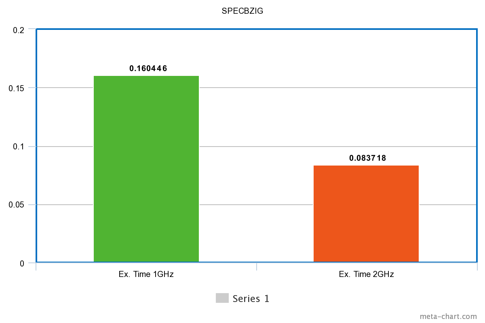
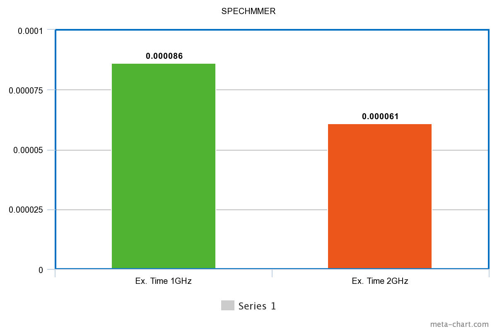
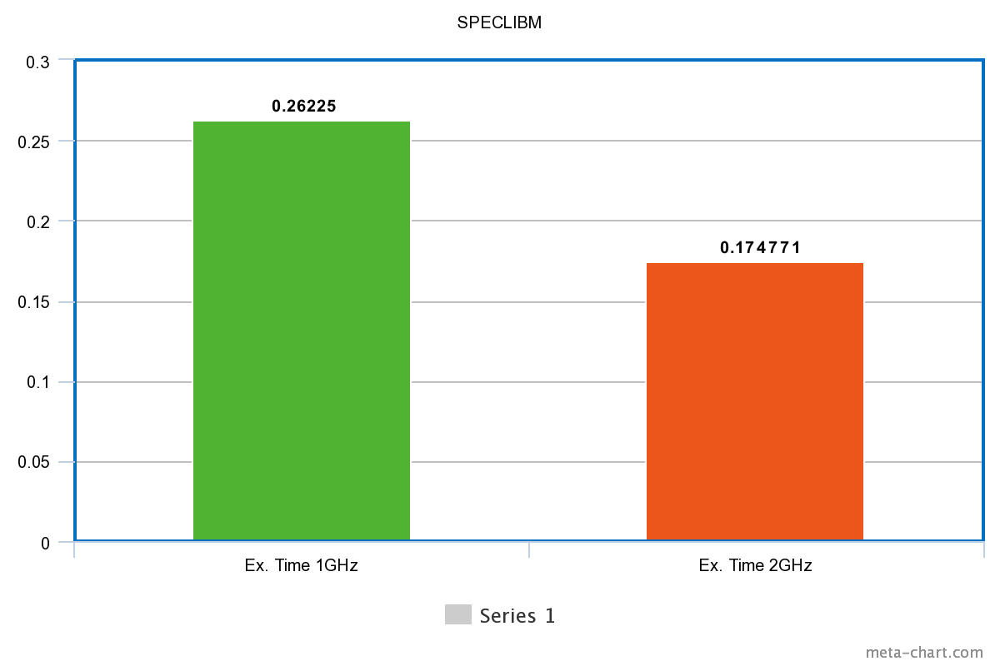
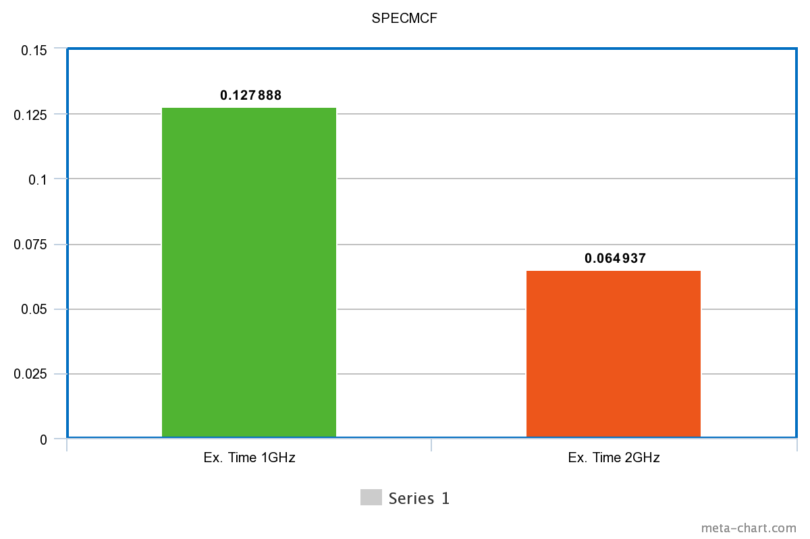
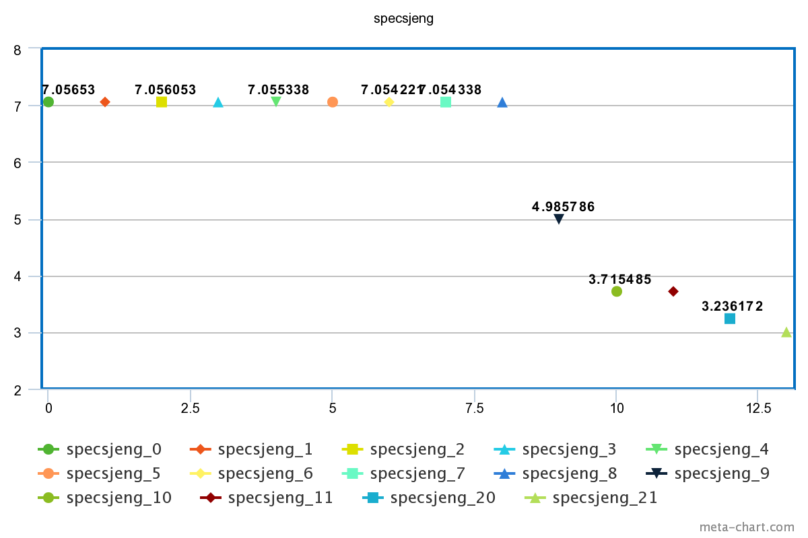
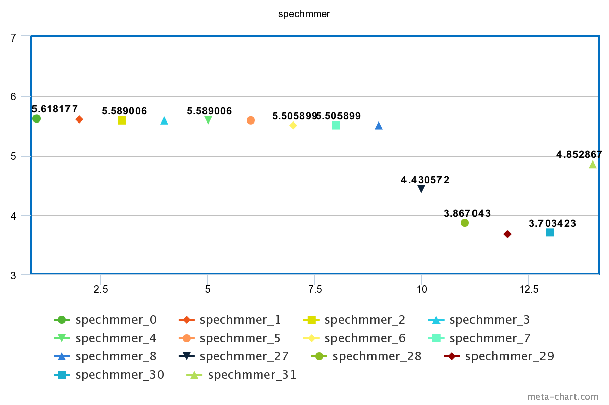
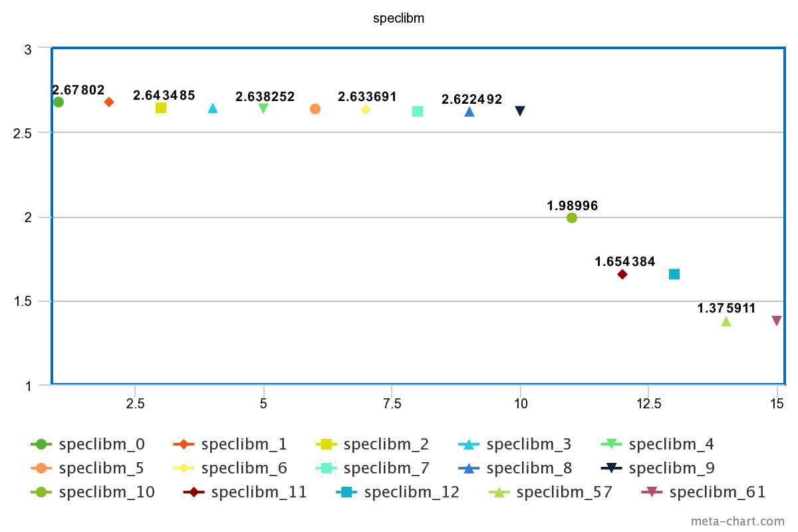
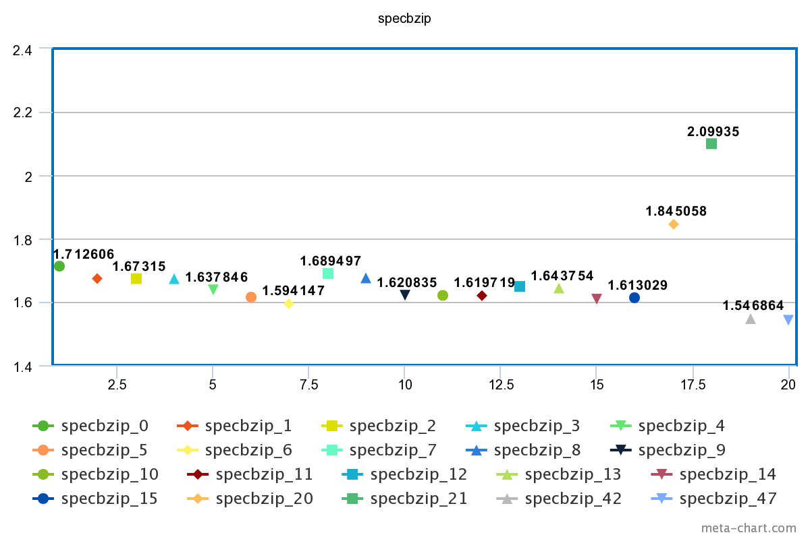
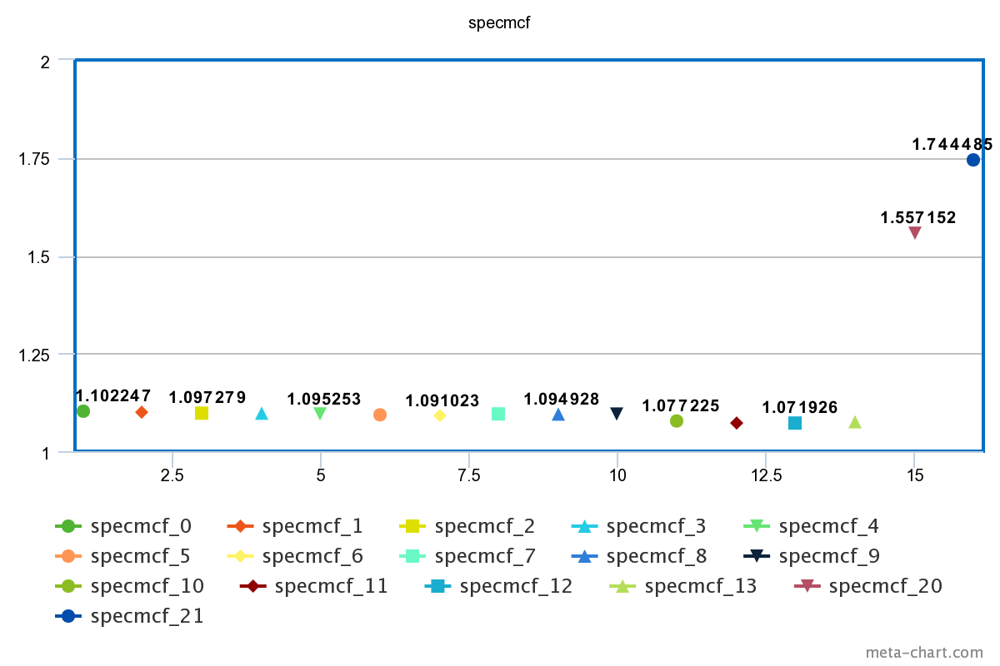
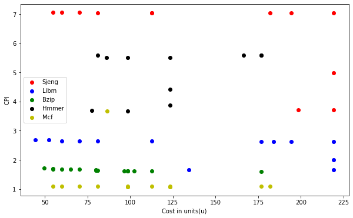

# Computer Architecture Lab 2

## Ομάδα 11
### Καλαντζής Γεώργιος 8818 gkalantz@ece.auth.gr
### Κοσέογλου Σωκράτης 8837 sokrkose@ece.auth.gr

Σκοπός της συγκεκριμένης εργασίας είναι η προσομοίωση μερικών bentchmarks στο gem5, η σύγκριση των αποτελεσμάτων τους καθώς και η αλλαγή διάφορων παραμέτρων του συστήματος έτσι ώστε να προσπαθήσουμε να βελτιστοποιήσουμε την απόδοση τους. Επίσης, έγινε και μια μελέτη σύγκρισης της απόδοσης σε σε σχέση με το κόστος της κάθε επιλογής.


#### Ερώτημα 1

#### A.

Στο πρώτο ερώτημα θα βρούμε κάποιες από τις παραμέτρους του συστήματος μας. Πιο συγκεκριμένα θα βρούμε τις παραμέτρους των Caches που χρησιμοποιεί το μοντέλο MinorCPU κατά την εκτέλσεση των 5 benchmarck τα οποία μελετάμε σε αυτή την εργασία.

Αρχικά, το script _se.py_ κατά την μοντελοποίηση του κάθε bentchmark πέρνει ώς ορίζματα τα `--cpu-type = MinorCPU --caches --l2cahce` το οποίο δηλώνει ότι θα χρησιμοποιήσουμε το αρκετά εξελιγμένο μοντέλο MinorCPU το οποίο χρησιμοποιεί τεχνικές _pipeline_, με κλασικές caches και χρησιμοποιεί μέχρι και Level 2 Cache. Εξετάζοντας το script _se.py_ βλέπουμε ότι κάνει import το script **options.py** το οποίο ορίζει τα default values των Caches σε περίπτωση που δεν τα δώσουμε εμείς ως ορίσματα. Παρακάτω φαίνεται το τμήμα του κώδικα που επιτελεί αυτή την λειτουργία.

```ruby
    # Cache Options
    parser.add_option("--external-memory-system", type="string",
                      help="use external ports of this port_type for caches")
    parser.add_option("--tlm-memory", type="string",
                      help="use external port for SystemC TLM cosimulation")
    parser.add_option("--caches", action="store_true")
    parser.add_option("--l2cache", action="store_true")
    parser.add_option("--num-dirs", type="int", default=1)
    parser.add_option("--num-l2caches", type="int", default=1)
    parser.add_option("--num-l3caches", type="int", default=1)
    parser.add_option("--l1d_size", type="string", default="64kB")
    parser.add_option("--l1i_size", type="string", default="32kB")
    parser.add_option("--l2_size", type="string", default="2MB")
    parser.add_option("--l3_size", type="string", default="16MB")
    parser.add_option("--l1d_assoc", type="int", default=2)
    parser.add_option("--l1i_assoc", type="int", default=2)
    parser.add_option("--l2_assoc", type="int", default=8)
    parser.add_option("--l3_assoc", type="int", default=16)
    parser.add_option("--cacheline_size", type="int", default=64)
```

Τα παραπάνω μπορούμε να τα επιβεβαιώσουμε και από τα αποτελέσματα των προσομοιώσεων και συγκεκριμένα μέσα στο αρχείο config.ini, όπως φαίνεται παρακάτω.

```ruby
[system]
cache_line_size=64
..
[system.cpu.dcache]
assoc=2
data_latency=2
mshrs=4
response_latency=2
size=65536          # 65536/1024 = 64 -> 64kBytes
tag_latency=2
..
[system.cpu.icache]
assoc=2
data_latency=2
mshrs=4
response_latency=2
size=32768          # 32768/1024 = 32 -> 32kBytes
tag_latency=2
..
[system.l2]
assoc=8
data_latency=20
mshrs=20
response_latency=20
size=2097152        # 2097152/1024 = 2048 = 2*1024 -> 2MBytes
tag_latency=20
```

Συνοπτικά,

| Caches        | L1 Instr. Cache| L1 Data Cache  | L2 Cache        |
| ------------- | -------------  | -------------  | -------------   |
| Resp. latency | 2              | 2              | 20              |
| Tag   latency | 2              | 2              | 20              | 
| Data  latency | 2              | 2              | 20              |
| Associetivity | 2              | 2              | 8               | 
| Miss Stat. Reg.| 4             | 4              | 8               |
| Size          | 64kB           | 32kB           | 2MB             |


#### B.

Στο ερώτημα αυτό θα καταγράψουμε κάποια από τα βασικά αποτελέσματα των διαφορετικών benchmarks. Πιο συγκεκριμένα θα καταγράψουμε τον χρόνο εκτέλεσης, τα CPI καθώς και τα miss rates, τα οποία είναι και οι πιο σημαντικές μετρικές αξιολόγησης της απόδοσης ενός συστήματος.

Παρακάτω βλέπουμε τα αποτελέσματα stats.txt του εκάστοτε benchmark.

**SPECMCF**
```ruby
sim_seconds                                  0.064937                       # Number of seconds simulated
system.cpu.committedInsts                   100000000                       # Number of instructions committed
system.cpu.cpi                               1.298734                       # CPI: cycles per instruction
system.cpu.idleCycles                        13385466                       # Total number of cycles that the object has spent stopped
system.cpu.numCycles                        129873417                       # number of cpu cycles simulated
system.cpu.dcache.overall_miss_rate::total   0.002079                       # miss rate for overall accesses
system.cpu.icache.overall_miss_rate::total   0.023610                       # miss rate for overall accesses
system.l2.overall_miss_rate::total           0.055082                       # miss rate for overall accesses
```

**SPECBZIG**
```ruby
sim_seconds                                  0.083718                       # Number of seconds simulated
system.cpu.committedInsts                   100000000                       # Number of instructions committed
system.cpu.cpi                               1.674353                       # CPI: cycles per instruction
system.cpu.idleCycles                        34708666                       # Total number of cycles that the object has spent stopped
system.cpu.numCycles                        167435346                       # number of cpu cycles simulated
system.cpu.dcache.overall_miss_rate::total   0.014248                       # miss rate for overall accesses
system.cpu.icache.overall_miss_rate::total   0.000077                       # miss rate for overall accesses
system.l2.overall_miss_rate::total           0.295243                       # miss rate for overall accesses
```

**SPECLIBM**
```ruby
sim_seconds                                  0.174771                       # Number of seconds simulated
system.cpu.committedInsts                   100000000                       # Number of instructions committed
system.cpu.cpi                               3.495428                       # CPI: cycles per instruction
system.cpu.idleCycles                       232191409                       # Total number of cycles that the object has spent stopped
system.cpu.numCycles                        349542816                       # number of cpu cycles simulated
system.cpu.dcache.overall_miss_rate::total   0.060972                     # miss rate for overall accesses
system.cpu.icache.overall_miss_rate::total   0.000093                     # miss rate for overall accesses
system.l2.overall_miss_rate::total           0.999944                       # miss rate for overall accesses
```

**SPECHMMER**
```ruby
sim_seconds                                  0.000061                       # Number of seconds simulated
system.cpu.committedInsts                       15136                       # Number of instructions committed
system.cpu.cpi                               8.020943                       # CPI: cycles per instruction
system.cpu.idleCycles                           93669                       # Total number of cycles that the object has spent stopped
system.cpu.numCycles                           121405                       # number of cpu cycles simulated
system.cpu.dcache.overall_miss_rate::total   0.055729                     # miss rate for overall accesses
system.cpu.icache.overall_miss_rate::total   0.095053                     # miss rate for overall accesses
system.l2.overall_miss_rate::total           0.937422                       # miss rate for overall accesses
```

**SPECSJENG**
```ruby
sim_seconds                                  0.513811                       # Number of seconds simulated
system.cpu.committedInsts                   100000001                       # Number of instructions committed
system.cpu.cpi                              10.276223                       # CPI: cycles per instruction
system.cpu.idleCycles                       805933933                       # Total number of cycles that the object has spent stopped
system.cpu.numCycles                       1027622265                       # number of cpu cycles simulated
system.cpu.dcache.overall_miss_rate::total   0.121831                       # miss rate for overall accesses
system.cpu.icache.overall_miss_rate::total   0.000020                       # miss rate for overall accesses
system.l2.overall_miss_rate::total           0.999972                       # miss rate for overall accesses
```

Συνοπτικά,

|               | SPECMCF        | SPECBZIG       | SPECLIBM        | SPECHMMER       | SPECSJENG       |
| ------------- | -------------  | -------------  | -------------   | -------------   | -------------   |
| Execution Time| 0.064937       | 0.083718       | 0.174771        | 0.000061        |  0.513811       |
| CPI           | 1.298734       | 1.674353       | 3.495428        | 8.020943        | 10.276223       | 
|DCache Miss Rate| 0.002079      | 0.014248       | 0.060972        | 0.055729        | 0.121831        |
|ICache Miss Rate| 0.023610      | 0.000077       | 0.000093        | 0.095053        | 0.000020        | 
|L2Cache Miss Rate| 0.055082     | 0.295243       | 0.999944        | 0.937422        | 0.999972        |

#### Γ.

Στο ερώτημα αυό θα αλλάξουμε την συχνότητα χρονισμού του επεξεργαστή (**CPU**) για κάθε benchmark, έτσι ώστε να παρατηρήσουμε και να κατανοήσουμε τις επιπτώσεις που θα έχει αυτή η αλλαγή. Στην εκφώνηση της εργασίας, ζητείται να αλλάξουμε την συχνότητα της cpu από την _default_ σε **2GHz**. Παρ' όλα αυτά, όπως φαίνεται και παρακάτω η default τιμή της CPU CLOCK είναι ήδη 2GHz, συνεπώς η προσθήκη του cmdarg (--cpu-clock=2GHz) δεν θα είχε κανένα impact στην προσομοίωση μας. Έτσι, επιλέξαμε να μεταβάλουμε την default συχνότητα που είναι 2GHz σε 1GHz, έτσι ώστε να μπορέσουμε να παρατηρήσουμε τις αλλαγές που θα επιφέρει στο κάθε bentchmark η αλλαγή της συχνότητας. Άρα, προσθέσαμε το argument (**--cpu-clock=1GHz**).

Ανοίγοντας, ενα οποιδήποτε stats.txt file απο τα 5 benchmarks μπορούμε να βρούμε σημαντικές πληροφορίες για τις τιμές των ρολογιών της CPU αλλά και του συστήματος. Οι πληροφορίες αυτές φαίνονται παρακάτω:

```ruby
..
system.clk_domain.clock                          1000                       # Clock period in ticks
..
system.cpu_clk_domain.clock                      1000                       # Clock period in ticks
..
```

Το **system.clk_domain.clock** είναι η συχνότητα ρολογιού του **συστήματος** ενώ το **system.cpu_clk_domain.clock** είναι η συχνότητα ρολογιού της **CPU**. Τόσο η συχνότητα της CPU όσο και η συχνοτητα του συστήματος είναι **1GHz**, αφού η περίοδος είναι 1000 ticks (1 tick = 1 picosecond), δηλαδή είναι **1ns**. Η συχνότητα ρολογιού της CPU χρονίζει όλα τα ψηφιακά συστήματα στο εσωτερικό του επεξεργαστή. Δηλαδή χρονίζει την ALU, την Control Unit καθώς και τις Level 1 και Level 2 Caches οι οποίες βρίσκονται στο εσωτερικό της CPU. Η συχνότητα του συστήματος χρονίζει τα περιφερειακά συστήματα και πιο συγκεκτριμένα στο μοντέλο _System-Call Emulation (SE)_, χρονίζει την μνήμη RAM (ή αλλιώς DRAM, αφου αποτελείτε κυρίως απο DRAM,σε αντίθεση με τις Caches οπου αποτελούνται απο SRAM). 

Για να επιβεβαιώσουμε αυτά που είπαμε παραπάνω μπορούμε να δούμε τα συγκεκριμένα αποτελέσματα του confings.ini.

```ruby
[system.clk_domain]
type=SrcClockDomain
clock=1000
domain_id=-1
eventq_index=0
init_perf_level=0
voltage_domain=system.voltage_domain
..
[system.cpu_clk_domain]
type=SrcClockDomain
clock=1000
domain_id=-1
eventq_index=0
init_perf_level=0
voltage_domain=system.cpu_voltage_domain
..
[system.cpu]
clk_domain=system.cpu_clk_domain
..
[system.cpu.dcache]
clk_domain=system.cpu_clk_domain
..
[system.cpu.icache]
clk_domain=system.cpu_clk_domain
..
[system.dvfs_handler]
sys_clk_domain=system.clk_domain
..
[system.l2]
clk_domain=system.cpu_clk_domain
..
[system.mem_ctrls]
clk_domain=system.clk_domain
..
[system.mem_ctrls.dram]
clk_domain=system.clk_domain
..
[system.membus]
clk_domain=system.clk_domain
..
[system.tol2bus]
clk_domain=system.cpu_clk_domain
..
```

Όπως βλεπουμε και από το config.ini, αυτά τα οποία είπαμε παραπάνω επιβεβαιώνονται καθώς τα dcache, icache, l2cache, cpu χρονίζονται με **system.cpu_clk_domain** το οποίο είναι η συχνότητα CPU, ενώ η DRAM χρονίζεται με το **system.clk_domain**, δηλαδή την συχνότητα του συστήματος. Αυτό που επίσης παρατηρούμε είναι ότι το κύκλωμα το DVFS Handler (Dynamic Voltage-Frequency Handler) της CPU (δηλαδή η αυξομείωση της τάσης και της συχνότητας της CPU ανάλογα με τον "φόρτο εργασίας") χρονίζεται με την συχνότητα του συστήματος, πράγμα το οποίο είναι και λογικό αφού χρειάζεται μια σταθερή συχνότητα (System Frequency) για να μεταβάλει την συχνότητα της CPU (CPU Frequency) ώστε να μειώσει και τις απώλειες Joule όταν δεν υπάρχει μεγάλη ανάγκη επεξεργαστικής ισχύς.

Αν προσθέσουμε άλλον έναν επεξεργαστή, η συχνότητα χρονισμού του θα είναι η συχνότητα της **CPU (CPU Frequency)**. Στην πραγματικότητα όμως δεν είναι απαραίτητο όλοι οι processors ενός συστήματος να τρέχουν στην ίδια συχνότητα, καθώς υπάρχουν και πολυπύρηνοι επεξεργαστές, όπως οι **big.LITTLE** της ARM που έχουν δυο είδη επεξεργαστών, εναν _LITTLE processor_ ο οποίος είναι σχεδιασμένος για power efficiency και τρέχει σε μικρότερες συχνότητες και εναν _big processor_ ο οποίος τρέχει σε μεγαλύτερες συχνότητες και είναι σχεδιασμένος για υψηλά υπολογιστικά φορτία.

Ας πάμε λοιπόν να συγκρίνουμε τα αποτελέσματα του προηγούμενου ερωτήματος που έγιναν με **2GHz** CPU Frequency, με αυτά που έτρεξαν με **1GHz** CPU Frequency.

Συνοπτικά, τα αποτελέσματα των προσομοιώσεων με **1GHz** είναι ως εξης:

|               | SPECMCF        | SPECBZIG       | SPECLIBM        | SPECHMMER       | SPECSJENG       |
| ------------- | -------------  | -------------  | -------------   | -------------   | -------------   |
| Execution Time| 0.127888       | 0.160446       | 0.262250        | 0.000086        |  0.705456       |
| CPI           | 1.278885       | 1.604463       | 2.622500        | 5.683272        | 7.054557        |
|DCache Miss Rate| 0.002079      | 0.014124       | 0.060971        | 0.055718        | 0.121831        | 
|ICache Miss Rate| 0.023625      | 0.000077       | 0.000093        | 0.095117        | 0.000020        |
|L2Cache Miss Rate| 0.055082     | 0.295238       | 0.999944        | 0.937422        | 0.999972        |










Όπως είναι λογικό, η μείωση της συχνότητας του ρολογιού έχει ως αποτέλεσμα την αύξηση του χρόνου εκτέλεσης. Θα περίμενε κανείς πως ο υποδιπλασιασμός της συχνότητας θα επιφέρει διπλασιασμό του χρόνου εκτέλεσης. Παρ' όλα αυτά αυτό δεν συμβαίνει στην πράξη σύμφωνα με τον παρακάτω πίνακα.

| **Scaling**   | 1GHz CPU Clock | 2GHz CPU Clock |
| ------------- | -------------  | -------------  |
| SPECMCF       | 1              | 1.96           |
| SPECBZIG      | 1              | 1.91           |
| SPECLIBM      | 1              | 1.5            |
| SPECHMMER     | 1              | 1.41           |
| SPECSJENG     | 1              | 1.37           |

Φαίνεται ότι κάποια από τα benchmarks έχουν σχεδόν τέλειο scaling αλλά κάποια άλλα, όπως τα speclibm, spechmmer και specsjeng δεν έχουν τέλειο scaling. Αυτό συμβαίνει διότι τα συγκεκριμένα benchmark έχουν αρκετά μεγάλο **Level 2 Cache Miss Rate**, συνεπώς γίνονται αρκετές προσπελάσεις στην DRAM η οποία χρονίζεται με το ρολόι του συστήματος, το οποίο και δεν αλλάξαμε καθόλου. Αντίθετα, τα άλλα δυο benchmark έχουν σχεδόν τέλειο scaling, διότι τα DRAM overall accesses είναι αισθητά λιγότερα, συνεπώς ο υποδιπλασιασμός του ρολογιού είχε ως αποτέλεσμα σχεδόν διπλασιασμό του χρόνου εκτέλεσης. Το scaling παρ' όλα αυτά δεν είναι τέλειο, αλλά 1.96 και 1.91 αντίστοιχα και αυτό είναι λογικό καθώς το τέλειο scaling 2 μπορεί να επιτευχθεί μόνο θεωρητικά. 


#### Ερώτημα 2

#### Α.

Στο ερώτημα αυτό θα προσπαθήσουμε να αλλάξουμε διάφορες παραμέτρους του συστήματος και μελετήσουμε την απόδοση του κάθε benchmark. Πιο συγκεκριμένα, θα αλλάξουμε τις εξής παραμέτρους.

```ruby
‐ L1 instruction cache size
‐ L1 instruction cache associativity
‐ L1 data cache size
‐ L1 data cache associativity
‐ L2 cache size
‐ L2 cache associativity
‐ Cache Line Size
```

Αρχικά, ας πούμε λίγα λόγια για την εκτέλεση του κάθε benchmark με τις default τιμές και για CPU Frequency **1GHz**. Δηλαδή, για τα αποτελέσματα του πιο πάνω πίνακα.

#### SPECSJENG

Είναι το πιο αργό από τα 5 benchmark καθώς έχει **CPI = 7.05** και χρόνο εκτέλεσης **Ex. Time = 0.7** (για **commited instructions = 100000000**). Αυτό οφείλεται στο γεγονός ότι έχει 12.18% Data Cache Miss Rate καθώς και ότι κάνει πάρα πολλές φορές access την Level 2 Cache, λόγω του ότι έχει πάρα πολλά δεδομένα. `system.l2.overall_accesses::total              723580 ` Ένας τρόπος με τον οποίο αντιμετωπίσαμε παρακάτω το υψηλό αυτό **CPI** είναι η εκμετάλευση του **locality** της μνήμης. Δηλαδή, αυξήσαμε το **Cache Line Size** ή αλλιώς **Cache Block Size**.

#### SPECHMMER

Το συγκεκριμένο benchmark έχει **CPI=5.68** και αυτό οφείλεται στο σχετικά υψηλό **Data Cache Miss Rate** που είναι **5.57%** καθώς και το **Instruction Cache Miss Rate** που είναι **9.5%** Εδώ βλέπουμε και τα συνολικά misses.
`system.cpu.icache.overall_misses::total           563`
`system.cpu.dcache.overall_misses::total           304`
Έπειτα από αρκετές προσομοιώσεις με διαφορετικές παραμέτρους παρατηρήθηκε ότι τόσο η αύξηση μεγέθους των Caches όσο και η αύξηση του Associativity δεν είχαν ιδιέταιρο impact στην απόδοση του benchmarck. Αυτό το οποίο επηρέασε αρκετά την απόδοση του, όπως και πριν, ήταν η εκμετάλλευση του χωρικού **locality**, δηλαδή η αύξηση της γραμμής της Cache. 

#### SPECLIBM

Το συσγκεκριμένο benchmark έχει **CPI=2.62**. Τα Miss Rates της Instruction Cache είναι αρκετά ικανοποιητικό, ενώ το Data Cache Miss Rate είναι **6.09%**, συνεπώς είναι ένας βασικός παράγοντας του υψηλού CPI. Ένας όμως ακόμα μεγαλύτερος παράγοντας είναι το το υψηλό Miss Rate της Level 2 Cache, το οποίο είναι **99.99%**. Εδω βλεπουμε και τα συνολικά accesses. `system.cpu.dcache.demand_accesses::total     48795261 ` `system.cpu.dcache.overall_misses::total       2975121` `system.cpu.icache.overall_accesses::total      6046326` `system.cpu.icache.overall_miss_latency::total     51833000` `system.l2.overall_accesses::total             1488194` `system.l2.overall_misses::total               1488111`. ΄Οπως και στα προηγούμενα benchmark, ο τρόπος με τον οποίο θα προσπαθήσουμε να μειώσουμε το CPI είναι με το να εκμετελευτούμε την χωρική τοπικότητα.

#### SPECBZIG

Το συγκεκριμένο benchmark έχει σχετικά καλό CPI και αυτό φαίνεται και από το γεγονός ότι έχει αρκετά καλά Miss Rates για τις Level 1 και Level 2 Caches. Παρ' όλα αυτά η Level 2 Cache έχει αξιοσημείωτο Miss Rate το οποίο θα προσπαθήσουμε και να βελτιώσουμε. `system.l2.demand_accesses::total               683661` `system.l2.overall_misses::total                201843`. Επίσης αυτό το οποίο θα παρατηρήσουμε με τις προσωμοιώσεις είναι ότι το locality στο συγκεκριμένο benchmark δεν έχει και τόσο μεγάλο impact όσο είχε στα προηγούμενα benchmarks. Αυτό ίσως οφείλεται στο ότι τα δεδομένα τα οποία χρησιμοποιεί το πρόγραμμα σε κάποια δεδομένη στιγμή δεν είναι δίπλα. Αυτο το οποίο θα κάνουμε είναι να αυξήσουμε το μέγεθος και το associetivity των caches ώστε να μειώσουμε τα misses ακόμα περισσότερο και να αυξήσουμε την απόδοση του benchmark.

#### SPECMCF

Αυτό το benchmark είναι το καλύτερο απ' όλα και αυτό φαίνεται από το πολύ μικρό CPI το οποίο έχει. Συγκεριμένα έχει **CPI=1.27**. Αυτό είναι λογικό καθώς τα miss rates των caches είναι αρκετά μικρά. `system.l2.overall_accesses::total              723580` `system.l2.overall_misses::total                 39856` `system.cpu.dcache.overall_accesses::total     35735088` `system.cpu.dcache.overall_misses::total         74281` `system.cpu.icache.overall_accesses::total     28313755` `system.cpu.icache.overall_misses::total        668904`. Η βελτίωση του CPI είναι αρκετά δύσκολη, αλλά θα επιτευχθεί με την αύξηση των associetivity καθώς και τα μεγέθη των caches.


#### B.

#### SPECSJENG

Στο παρακάτω διάγραμμα παρατηρούμε στον κατακόρυφο άξονα το CPI και στον οριζόντιο άξονα **μερικές** από τις προσομοιώσεις που έγιναν. Οι παράμετροι των προσομοιώσεων αυτών φαίνονται στον παρακάτω πίνακα. Αυτό το οποίο μπορόυμε να παρατηρήσουμε είναι η μεγάλη συνεισφορά που έχει η **χωρική τοπικότητα**, καθώς βλεπουμε ότι αυξάνοντας το Cache Line Size μειώνεται και το CPI. Ενω επίσης παρατηρούμε ότι τόσο το Cache Size όσο και το associativity έχουν αρκετά μικρό impact στην απόδοση του benchmark.

|               | l1d_size        | l1i_size       | l2_size        | l1i_assoc       | l1d_assoc       | l2_assoc     | cacheline_size  | cpi    |
| ------------- | -------------  | -------------  | -------------   | -------------   | -------------   | -------------   | -------------  | ------------- |
|specsjeng_0	 | 32kB       | 64kB       |512kB         | 1       | 1       | 2       | 64        |7.056530        |
|specsjeng_1	| 64kB       | 64kB      | 512kB          | 1       |  1       | 2       | 64        |7.056086	 |
|specsjeng_2	| 128kB      | 64kB       |512kB        | 1        | 1      | 2       | 64        | 7.056053	|
|specsjeng_3	| 128kB      | 128kB       | 512kB       | 1        | 1       | 2      | 64        | 7.055731	| 
|specsjeng_4	| 128kB     | 128kB       | 1024kB         | 1        | 1       | 2       | 64        | 7.055338	|
|specsjeng_5	 | 128kB       | 128kB       | 2048kB       | 1       | 1       | 2       | 64        |7.054478	 |
|specsjeng_6	 | 128kB       | 128kB       | 2048kB        | 2       | 2       | 2       | 64        |7.054221	|
|specsjeng_7	 | 128kB      | 128kB       | 512kB        | 4        | 4       | 4       | 64        |7.054338	|
|specsjeng_8	 | 128kB      |128kB       | 512kB        | 8       | 8       | 8       | 64        |7.054502	 | 
|specsjeng_9	 | 128kB     | 128kB      | 512kB         | 8       | 8       | 8       | 64        | 4.985786	|
|specsjeng_10	 | 128kB       |128kB       | 512kB        |  4       | 4       | 4       | 128        |3.715485	 |
|specsjeng_11	 | 128kB       | 128kB       | 512kB        | 4       | 4       | 4       | 256        |3.715483	 |
|specsjeng_20	 | 32kB      | 64kB       | 512kB         |  1      |  1     |  2     | 512        |3.236172	 |
|specsjeng_21	 | 32kB      | 64kB       | 512kB         |  1      |  1     |  2     | 1024        |3.002167| 



#### SPECHMMER

Εδω βλέπουμε πάλι ότι η αύξηση της μνήμης καθώς και το associativity δεν έχουν τόσο μεγάλο impact στην απόδοση του benchmark. Αντίθετα, η εκμετάλλευση της τοπικότητας με την αύξηση του cache line size βελτιώνει αισθητά την απόδοση. Αυτό φαίνεται κυρίως στις προσοσοιώσεις _spechmmer_27_ και _spechmmer_28_.

|               | l1d_size        | l1i_size       | l2_size        | l1i_assoc       | l1d_assoc       | l2_assoc     | cacheline_size  | cpi    |
| ------------- | -------------  | -------------  | -------------   | -------------   | -------------   | -------------   | -------------  | ------------- |
|spechmmer_0 	 | 32kB       | 64kB       |2048kB         | 1       | 1       | 2       | 64        |5.618177	        |
|spechmmer_1 	| 64kB       | 64kB      | 2048kB          | 1       |  1       | 2       | 64        |5.605637	 |
|spechmmer_2 	| 128kB      | 64kB       |2048kB        | 1        | 1      | 2       | 64        | 5.589006	|
|spechmmer_3 	| 128kB      | 128kB       |2048kB       | 1        | 1       | 2      | 64        | 5.589006	| 
|spechmmer_4 	| 128kB     | 128kB       | 1024kB         | 1        | 1       | 2       | 64        | 5.589006	|
|spechmmer_5 	 | 128kB       | 128kB       | 512kB       | 1       | 1       | 2       | 64        |5.589006	|
|spechmmer_6 	 | 128kB       | 128kB       | 512kB        | 2       | 2       | 2       | 64        |5.505899	|
|spechmmer_7 	 | 128kB      | 128kB       | 512kB        | 4        | 4       | 4       | 64        |5.505899	|
|spechmmer_8 	 | 128kB      |128kB       | 512kB        | 8       | 8       | 8       | 64        |5.505899	| 
|spechmmer_27 	 | 128kB     | 128kB      | 512kB         | 8       | 8       | 8       | 128        |4.430572	|
|spechmmer_28 	 | 128kB       |128kB       | 512kB        |  8       | 8       | 8       | 256        |3.867043	|
|spechmmer_29	 | 128kB       | 128kB       | 512kB        | 4       | 4       | 4       | 512        |3.675353	 |
|spechmmer_30	 | 64kΒ      | 64kB       | 512kB         |  4      |  4     |  4     | 512        |3.703423	 |
|spechmmer_31	 | 32kΒ      | 64kB       | 512kB         |  1      |  1     |  2     | 1024        |4.852867	 |



#### SPECLIBM.

Στην συνέχεια βλέπουμε κάποια από τα αποτελέσματα τα οποία βγάλαμε μετά από διάφορες προσοσμοιώσεις. Αυτό που μπορούμε να παρατηρήσουμε είναι την μεγάλη βελτίωση από την προσομοίωση _speclibm_9_ στην _speclibm_10_, λόγω της αύξησης της χωρικής τοπικότητας με την αύξηση του cashe line size.

|               | l1d_size        | l1i_size       | l2_size        | l1i_assoc       | l1d_assoc       | l2_assoc     | cacheline_size  | cpi    |
| ------------- | -------------  | -------------  | -------------   | -------------   | -------------   | -------------   | -------------  | ------------- |
|speclibm_0 	 | 16kB       | 16kB       |512kB         | 1       | 1       | 2       | 64        |2.678020	|
|speclibm_1  	 | 16kB       | 64kB      | 512kB          | 1       |  1       | 2       | 64        |2.678059	 |
|speclibm_2  	 | 64kB      | 64kB       |512kB        | 1        | 1      | 2       | 64        | 2.643485	|
|speclibm_3 	 | 64kB      | 128kB       |512kB       | 1        | 1       | 2      | 64        | 2.643485	| 
|speclibm_4 	 | 128kB     | 128kB       | 512kB         | 1        | 1       | 2       | 64        | 2.638252	|
|speclibm_5 	 | 128kB       | 128kB       | 1024kB       | 1       | 1       | 2       | 64        |2.637369		|
|speclibm_6 	 | 128kB       | 128kB       | 2048kB        | 1       | 1       | 2       | 64        |2.633691	|
|speclibm_7 	 | 128kB      | 128kB       | 2048kB        | 2        | 2       | 4       | 64        |2.622492	|
|speclibm_8 	 | 128kB      |128kB       | 2048kB        | 4       | 4       | 4       | 64        |2.622492		| 
|speclibm_9 	 | 128kB     | 128kB      | 2048kB         | 8       | 4       | 8       | 64        |2.622492	|
|speclibm_10 	 | 128kB       |128kB       | 2048kB        |  8       | 8       | 8       | 128        |1.989960	|
|speclibm_11     | 128kB       | 128kB       | 2048kB        | 8       | 8       | 8       | 256        |1.654384	|
|speclibm_12     | 64kΒ      | 64kB       | 1024kB         |  8      |  8     |  8     | 256        |1.654755	|
|speclibm_57     | 128kB       | 128kB       | 4ΜΒ        | 4       | 4       | 4       | 2048        |1.375911	|
|speclibm_61     | 128kΒ      | 128kB       | 4ΜΒ         |  32      |  32     |  16     | 2048        |1.375902   |




#### SPECBZIG.

Το συγκεκριμένο benchmarck, σε αντίθεση με τα προηγούμενα δεν επηρεάζεται σε μεγάλο βαθμό από την τοπικότητα της μνήμης, αλλά επηρεάζεται αρκετά από την μείωση των miss rates μέσω της αύξησης του μεγέθους των Caches αλλά και των associetivity τους. Παρ' όλα αυτά, το συγκεκριμένο μοντέλο είναι ήδη αρκετά αποδοτικό συνεπώς οι αλλαγές που κάναμε είχαν ως αποτέλεσμα μικρές βελτιστοποιήσεις σε σχέση με τα προηγούμενα benchmarks.

|               | l1d_size        | l1i_size       | l2_size        | l1i_assoc       | l1d_assoc       | l2_assoc     | cacheline_size  | cpi    |
| ------------- | -------------  | -------------  | -------------   | -------------   | -------------   | -------------   | -------------  | ------------- |
|specbzip_0	 	 | 32kB       | 32kB       |512kB         | 1       | 1       | 2       | 64        |1.712606		        |
|specbzip_1	 	| 64kB       | 32kB      | 512kB          | 1       |  1       | 2       | 64        |1.673547		 |
|specbzip_2	 	| 64kB      | 64kB       |512kB        | 1        | 1      | 2       | 64        | 1.673150		|
|specbzip_3	 	| 64kB      | 128kB       |512kB       | 1        | 1       | 2      | 64        |1.673150		| 
|specbzip_4	 	| 128kB     | 128kB       | 512kB         | 1        | 1       | 2       | 64        | 1.637846	|
|specbzip_5	 	 | 128kB       | 128kB       | 1024kB       | 1       | 1       | 2       | 64        |1.614752	|
|specbzip_6	 	 | 128kB       | 128kB       | 2048kB        | 1       | 2       | 2       | 64        |1.594147	|
|specbzip_7	 	 | 32kB      | 32kB       | 512kB        | 2        | 2       | 2       | 64        |1.689497	|
|specbzip_8	 	 | 32kB      |32kB       | 512kB        | 4       | 4       | 2       | 64        |1.675726		| 
|specbzip_9	 	 | 128kB     | 128kB      | 512kB         | 4       | 4       | 2       | 64        |1.620835	|
|specbzip_10 	 | 128kB       |128kB       | 512kB        |  4       | 4       | 4       | 64        |1.620440	|
|specbzip_11	 | 128kB       | 128kB       | 512kB        | 4       | 4       | 8       | 64        |1.619719	|
|specbzip_12	 | 128kB      | 128kB       | 512kB         |  1      |  1     |  1     | 64        |1.648521	|
|specbzip_13	 | 128kB      | 128kB       | 512kB         |  1      |  1     |  1     | 128        |1.643754	|
|specbzip_14 	 | 128kB      |128kB       | 512kB        | 4       | 4       | 4       | 128        |1.608345	| 
|specbzip_15 	 | 128kB     | 128kB      | 512kB         | 4       | 4       | 4       | 256        |1.613029	|
|specbzip_20 	 | 32kB       |32kB       | 512kB        |  1       | 1       | 2       | 512        |1.845058	|
|specbzip_21	 | 32kB       | 32kB       | 512kB        | 1       | 1       | 2       | 1024        |2.099350	|
|specbzip_42	 | 128kB      | 128kB       | 4MB         |  16      |  16     |  8     | 128        |1.546864	 |
|specbzip_47	 | 128kB      | 128kB       | 4MB         |  16      |  16     |  8     | 256        |1.541780	 |



#### SPECMCF.

To benchmark αυτό είναι ήδη αρκετά αποδοτικό, συπεπώς ήταν αρκετά δύσκολο το να το βελτιστοποιήσουμε αρκετά. Ο τρόπος όμως με τον οποίον μπορέσαμε να το βελτιώσουμε ήταν με το να μειώσουμε τα Cache Miss Rates, με το να αυξήσουμε το μέγεθος των caches και το associetivity του. Επίσης, όπως και στο προηγούμενο benchmark, το SPECMCF δεν επηρεάζεται από την τοπικότητα της μνήμης, συνεπώς η αύξηση των cache line sizes δεν βελτιώνει αισθητά την απόδοση του benchmark αυτού.

|               | l1d_size        | l1i_size       | l2_size        | l1i_assoc       | l1d_assoc       | l2_assoc     | cacheline_size  | cpi    |
| ------------- | -------------  | -------------  | -------------   | -------------   | -------------   | -------------   | -------------  | ------------- |
|specmcf_0	 	 | 32kB       | 64kB       |512kB         | 1       | 1       | 2       | 64        |1.102247			        |
|specmcf_1	 	 | 64kB       | 64kB      | 512kB          | 1       |  1       | 2       | 64        |1.099705	 |
|specmcf_2	 	 | 128kB      | 64kB       |512kB        | 1        | 1      | 2       | 64        | 1.097279	|
|specmcf_3	 	 | 128kB      | 128kB       |512kB       | 1        | 1       | 2      | 64        |1.097201	| 
|specmcf_4	 	 | 128kB     | 128kB       | 1024kB         | 1        | 1       | 2       | 64        |1.095253	|
|specmcf_5	 	 | 128kB       | 128kB       | 2048kB       | 1       | 1       | 2       | 64        |1.093063	|
|specmcf_6	 	 | 128kB       | 128kB       | 2048kB        | 2       | 2       | 2       | 64        |1.091023	|
|specmcf_7	 	 | 32kB      | 32kB       | 512kB        | 4        | 4       | 4       | 64        |1.095318	|
|specmcf_8	 	 | 32kB      |32kB       | 512kB        | 8       | 8       | 8       | 64        |1.094928	| 
|specmcf_9	 	 | 128kB     | 128kB      | 512kB         | 8       | 8       | 8       | 64        |1.094928	|
|specmcf_10 	 | 128kB       |128kB       | 512kB        |  4       | 4       | 4       | 128        |1.077225	|
|specmcf_11	     | 128kB       | 128kB       | 512kB        | 4       | 4       | 4       | 256        |1.072008	|
|specmcf_12	     | 128kB      | 128kB       | 512kB         | 8      |  8     |  8     | 256        |1.071926	|
|specmcf_13 	 | 64kB      | 64kB       | 256kB         |  8      |  8     |  8     | 256        |1.075348	|
|specmcf_20 	 | 32kB      |32kB       | 512kB        | 1       | 1       | 2       | 512        |1.557152	| 
|specmcf_21 	 | 32kB     | 32kB      | 512kB         | 1       | 1       | 2       | 1024        |1.744485	|




Πίνακας αποτελεσμάτων για κάθε benchmark με τις βέλτιστες παραμέτρους απο τα simulations που τρέξαμε:

|               | l1d_size        | l1i_size       | l2_size        | l1i_assoc       | l1d_assoc       | l2_assoc     | cacheline_size  | cpi    |
| ------------- | -------------  | -------------  | -------------   | -------------   | -------------   | -------------   | -------------  | ------------- |
| specsjeng     | 32kB           |  64kB           |  512kB           |  1               |   1              |  2               | 1024           | 3.002167 |
| spechmmer     | 128kB	         |128kB	           |512kB		      |  4               |4                 |  4                | 512           | 3.675353 |
| speclibm      | 128kB          | 128kB           |  4MB             | 32              | 32                | 16                | 2048          | 1.375902 |
| specbzig      | 128kB          | 128kb           | 4MB              | 16               | 16               | 8                 | 256           | 1.541780 |
| specmcf       | 64kB           | 64kB            | 256kB            | 8                | 8                | 8                 | 256           | 1.071926 |


#### Ερώτημα 3

Στο βήμα αυτό καλούμαστε να ανατρέξουμε στην βιβλιογραφία και να δημιουργήσουμε μια συνάρτηση κόστους έτσι ώστε να αξιολογήσουμε το της **"value for performance"** της κάθε σχεδιαστικής λύσης μας.

Αρχικά, αυτό το οποίο λάβαμε υπόψην μας είναι ότι το κόστος της Level 1 Cache είναι αρκετά μεγαλύτερο από το κόστος της Level 2 Cache η οποία έχει τουλάχιστον 10 φορές μεγαλύτερο latency. Στην συνέχεια, αυτά τα οποία λάβαμε υπόψην μας ήταν το μέγεθος της cahce καθώς και το associetivity αυτής. Όσον αφορά το μέγεθος, ορίσαμε ότι ο διπλασιασμός του μεγέθους της cache έχει ως συνέπεια τον διπλασιασμό του κόστους καθώς θα χρειαστεί ο διπλάσιος αριθμός transistor και υλικού για την κατασκευή του. Στην συνέχεια, όσον αφορά το associetivity των caches θεωρήσαμε αρχικά την Direct Mapped Associative (1-way Associative) την πίο φθηνή καθώς είναι η πιο απλή και έχει μόνο ένα συγκριτή. Ταυτόχρονα όμως είναι και αυτή που παρουσιάσει το μεγαλύτερο Miss Rate. Έπειτα θεωρήσαμε ότι η 2-way Associative έχει μεγαλύτερο κόστος καθώς αυξάνεται η πολυπλοκότηρα της Cache, ενώ προστίθεται ένας επιπλέον συγκριτής. Με την ίδια λογική η 4-way Associative είναι πιο φθηνή από την 8-way Associative και αυτή με την σειρά της πιο φθηνή από μια Fully-Associative Cache.

Στην συνέχεια, για την υλοποίηση της συνάρτησης κόστους, θα δημιουργήσουμε μεταβλητές κόστους για κάθε παράμετρο του σύστηματος,ανάλογα με το κόστος που προσδίδουν όταν τις μεταβάλλουμε.Δηλαδή έστω μια αυθαίρετη μόναδα κόστους u, αναθέτουμε τις τιμές κόστους για μια "base" περίπτωση , όπου  
 **L1i.size = 16kb , L1d.size = 16kb, L2.size = 16kb ,L1i.assoc = 1, L1d.assoc = 1, L2.assoc = 1 και cacheline.size = 64:**

| Parameters                         |           |
| -----------------------------------|-----------|           
| L1 instruction cache size          | X1 = 2.6u |
| L1 data cache size                 | X2 = 2.6u |
| L2 cache size                      | X3 = u    |
| L1 instruction cache associativity | X4 = 2.6u |
| L1 data cache associativity        | X5 = 2.6u |
| L2 cache associativity             | X6 = u    |
| Μέγεθος cache line                 | X7 = 0    |

Οπότε για πάραδειγμα αν είχαμε ένα σύστημα με παραμέτρους  
**L1i.size = 64kb , L1d.size = 32kb, L2.size = 32kb ,L1i.assoc = 2,L1d.assoc = 2, L2.assoc = 4 και cacheline.size = 128** . Τότε η συνάρτηση κόστους C(u), σύμφωνα με τις θεωρήσεις που κάναμε , θα προκύψει ως εξής για το συγκεκριμένο σύστημα:

C(u) = 4X1 + 2X2 + 2X3 + 2X4 + 2X5 + 4X6 + 2X7 = (6.8 + 2.8 + 3.4 + 2.8 + 2 + 4 )u = 21.8u

Τα βάρη της συνάρτησης κόστος επιλέχθηκαν έτσι ώστε να αντιπροσωπέυουν τα μεγέθη κόστους του υλικού που χρησιμοποιόυμε. Η L1 cache ανατίθεται μεγάλο βάρος και σε size και σε associativities (Instruction cache και data cache), συγκριτικά με την L2 καθώς είναι γνωστό ότι η κατασκευή της είναι πολύ πιο δαπανηρή. Το μέγεθος τις cache line δεν έχει κάποιο κόστος υλοποίησης. Επίσης τα associativities φυσικά και προσθέτουν και αυτά κόστος , μιας και προσθέτουν έξτρα υλικό στο σύστημα (συγκριτές) και αυξάνουν την πολυπλοκότητα.

Έπειτα υλοποιήθηκε ένα python script , το οποίο μας βοήθησε να υπολογίζουμε τις συναρτήσεις κόστους που προκύπτουν από τις παραμέτρους των simulations και δημιουργήσαμε ένα plot 
CPI vs Cost . Παρακάτω φαίνεται ένα μέρος του κώδικα.
```
import matplotlib.pyplot as plt


c = lambda x1,x2,x3,x4,x5,x6,x7 : 2.6*x1 + 2.6*x2 + x3 + 2.6*x4 + 2.6*x5 + x6 + 0*x7


costsLibm = []
costsbzip = []
costsjeng = []
costsmcf = []
costshmmer = []

for x in parametersLibm:
    
    costsLibm.append(c(x[0],x[1],x[2],x[3],x[4],x[5],x[6]))
    
for x in parametersbzip:
    
    costsbzip.append(c(x[0],x[1],x[2],x[3],x[4],x[5],x[6]))
    
for x in parametersjeng:
    
    costsjeng.append(c(x[0],x[1],x[2],x[3],x[4],x[5],x[6]))
    
for x in parametersmcf:
    
    costsmcf.append(c(x[0],x[1],x[2],x[3],x[4],x[5],x[6]))
    
for x in parametershmmer:
    
    costshmmer.append(c(x[0],x[1],x[2],x[3],x[4],x[5],x[6]))
    

    
plt.figure(figsize=(10,6))  
plt.scatter(costsjeng,sjengCPI,c = 'r', label = 'Sjeng')
plt.scatter(costsLibm,LibmCPI, c = 'b', label = 'Libm')
plt.scatter(costsbzip,bzipCPI, c = 'g', label = 'Bzip' )
plt.scatter(costshmmer,hmmerCPI, c = 'k', label = 'Hmmer')
plt.scatter(costsmcf,mcfCPI,c ='y',label= 'Mcf')
plt.ylabel('CPI')
plt.xlabel('Cost in units(u)')
plt.legend()

plt.show()
```
Και το plot που παράχθηκε είναι το εξής :



Στο οποίο φαίνονται και τα 5 benchmark. Είναι ξεκάθαρο και από το διάγραμμα το θετικό impact που έχει το cache line size στα περισσοτερα benchmarks , εφόσον χωρίς να προσθέτει κάποιο κόστος υλοποίησης ρίχνει δραματικά το CPI . Επίσης παρατηρούμε από το διάγραμμα ότι η αύξηση των μεγεθών της L2 και L1 caches δεν μείωνουν ικανοποιητικά το CPI σε όλα τα  benchmarks. Οπότε ως βέλτιστες λύσεις στα περισσότερα benchmarks θα προτιμούσαμε τα συστήματα με χαμηλό μέγεθος cache size/associativities οσο το δυνατόν περισσότερο και μεγάλο μέγεθος cache line size.


#### Κριτική Εργασίας

Αρχικά, η εργασία αυτή ήταν αρκετά ενδιαφέρουσα καθώς μελετήσαμε και κατανοήσαμε σε βάθος την λειτουργία των Caches καθώς και το κόστος το οποίο είχε η κάθε σχεδιαστική επιλογή μας. Ταυτόχρονα, ήταν αρκετά ενδιαφέρουσα καθώς είχαμε την ευκαιρία να εργαστούμε σαν παραγματικούς αρχιτέκτονες υπολογιστών, δεδομένου ότι τρέξαμε δίαφορα benchmarks και μέσω της κριτικής μας σκέψης προσπαθήσαμε να τα βελτιστοποιήσουμε. Τέλος, το μόνο σχόλιο το οποίο θα θέλαμε να κάνουμε είναι ότι θεωρήσαμε κάπως μεγάλο το πλήθος των benchmark τα οποία κληθήκαμε να μοντελοποιήσουμε καθώς ο χρόνος που χρειάστηκε να τρέξουν τα simulations ήταν αρκετά μεγάλος. Συνολικά όμως, η εργασία αυτή αποτέλεσε μια πολύ εκπαιδευτική διαδικασία καθώς όπως και στην προηγούμενη εργασία μπορέσαμε και είδαμε και στην πράξη αυτά το οποία διαβάζαμε στις διαφάνειες των διαλέξεων, αποσαφηνίζοντας έτσι ένοιες τις οποίος είχαμε λίγο πιο θωλές στο μυαλό μας.
