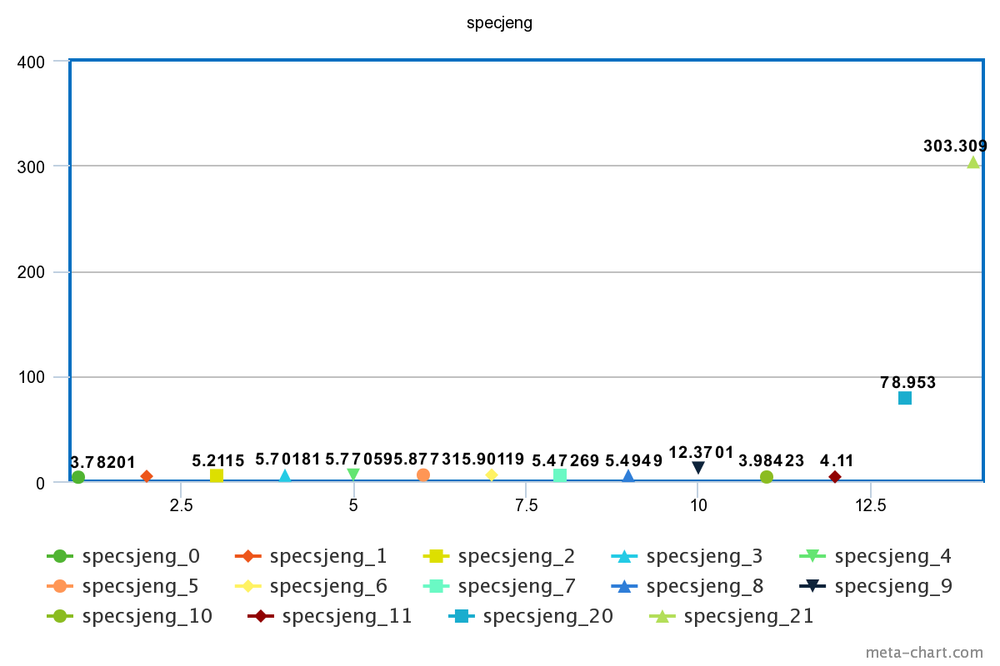
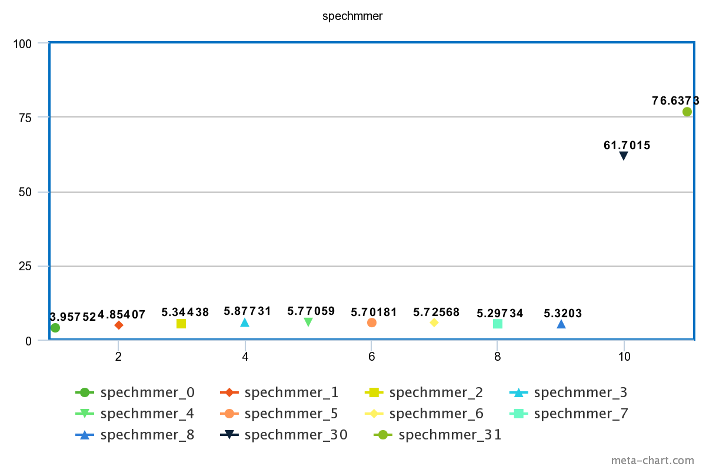
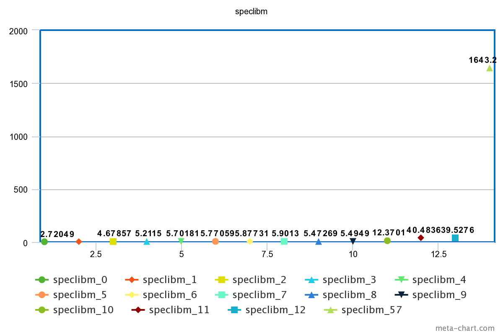
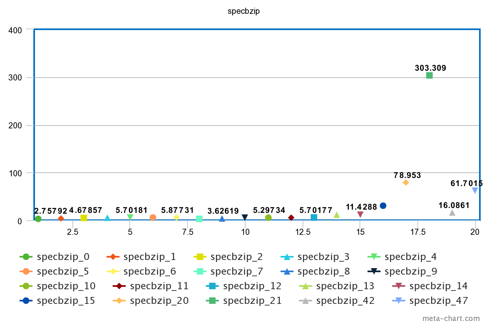
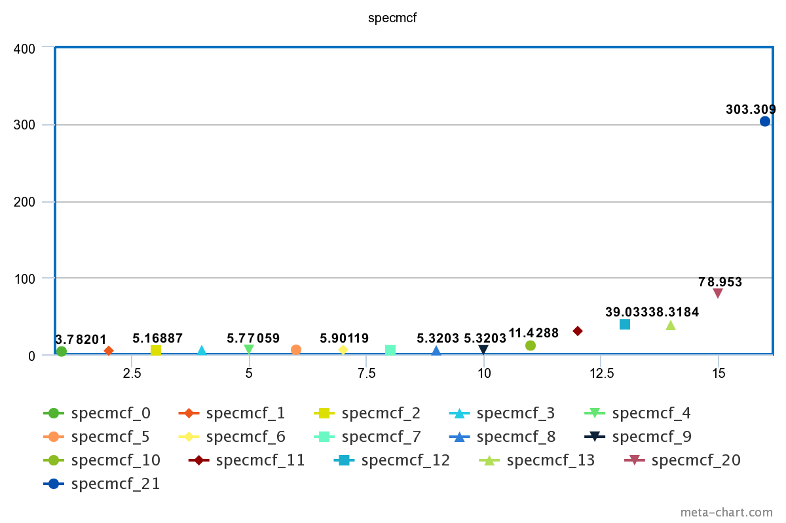

# Computer Architecture Lab 3

## Ομάδα 11
### Καλαντζής Γεώργιος 8818 gkalantz@ece.auth.gr
### Κοσέογλου Σωκράτης 8837 sokrkose@ece.auth.gr

Σκοπός της συγκεκριμένης εργασίας είναι η εξοικείωση με το McPAT framework, το οποίο μας δίνει την δυνατότητα να μοντελοποιούμε στις αρχιτεκτονικές μας ενεργειακές μετρικές, όπως energy-delay-area product (EDAP) και να μελετάμε διάφορα trade-offs στις σχεδιαστικές μας αποφάσεις.

#### Ερώτημα 1

#### A.

Στο συγκεκριμένο ερώτημα ζητείται να ανατρέξουμε στην βιβλιογραφία αναφορικά με τις απώλειες ισχύος σε ένα CMOS, έτσι ώστε να κατονοήσουμε καλύτερα τα αποτελέσματα του McPAT Simulator και πιο συγκεκριμένα, το **Dynamic Power** καθώς και το **Leakage** τα οποία δίνονται ως αποτελέσματα με το πέρας της κάθε προσομοίωσης. Αρχικά, οι συνολικές απώλειες ισχύος σε ένα CMOS είναι το άθροισμα της δυναμικής κατανάλωσης και της στατικής κατανάλωσης, δηλαδή, **P_total = P_dynamic + P_static**. Η δυναμική κατανάλωση με την σειρά της αποτελείτε από το άθροισμα των διακοπτικών απωλειών και το ρεύμα βραχυκυκλώματος, **P_dynamic = P_switcing + P_shortcircuit**. Ενώ οι στατικές απώλειες είναι αποτέλεσμα του **ρεύματος διαρροής υποκατωφίου** καθώς και του **ρεύματος διαρροής της πύλης**, δηλαδή δίνεται από τον τύπο **P_static = (I_sub + I_gate)\*Vdd** . Ας πάμε λοιπόν να αναλύσουμε πιο συγκεκριμένα όλες τις παραπάνω απώλειες ισχύος. 

* **Dynamic Power Dissipation**

  * **Switching\:**
     Ονομάζεται και **ισχύς μεταγωγής** και oρίζεται ως η απώλεια ισχύος που οφείλεται στην στις απώλειες που δημιουργούνται κατά την έναυση και σβέση ενός MOSFET. Πιο συγκεκριμένα, δεδομένου ότι και η τάση και το ρεύμα δεν μεταβάλονται ακαριαία, δηλαδή υπάρχει μια μικρή καθυστέρηση λόγω της χωρητικής φύσης του MOSFET, κατά την διάρκεια της ένασυσης και της σβέσης ενός MOSFET δημιουργούνται κάποιες απώλειες ισχύος πάνω στο MOSFET και δίνονται από το γινόμενο V\*I. Η ισχύς μεταγωγής εξάρταται από την συχνότητα ρολογιού, την χωρητικότητα του CMOS σε συνδυασμό με την χωρητικότητα εξόδου, το τετράγωνο της τάσης τροφοδοσίας καθώς έναν παράγοντα δραστηριότητας (activity factor a). Δηλαδή, δίνεται από τον τύπο **P_switching = a\*C\*V^2\*f**

  * **Short Circuit\:**
     Οι απώλειες βραχυκυκλώματος οφείλονται στο γεγονός ότι όταν σε ένα CMOS μεταβάλεται η κατάσταση του, στιγμιαία άγουν ταυτόχρονα και το pull-up pMOS FET αλλά και το pull-down nMOS FET. Κατα συνέπεια δημιουργείται στιγμιαία βραχυκύκλωμα μεταξύ γείωσης και τροφοδοσίας. Οι απώλειες αυτές είναι συνήθως περίπου το 10-20% της συνολικής δυναμικής κατανάλωσης σύμφωνα με την βιβλιογραφία. 

* **Static Power Dissipation**

  * **Subthreshold Leakage Current\:**
     Οφείλεται στο ρεύμα που διαρρέεται κατα την διάρκεια της περιοχής αποκοπής του τρανζίστορ. Πιο συγκεκριμένα, κατα την διάρκεια αποκοποής του transistor υπάρχει ένα μικρό leakage current που ρέει από το Drain στο Source ενός MOSFET.

  * **Gate Leakage Current\:**
     Οφείλεται στο ρεύμα που διαρρέται από την πύλη οξειδίου. Είναι επίσης σηματικό να αναφερθεί ότι το Gate Leakage είναι αρκετά μικρό και σχεδόν αμελητέο για τεχνολογίες άνω των 65nm, αλλά για μεγέθη λιθογραφίας μικρότερα των 65nm το Gate Leakage γίνεται αισθητό και μάλιστα συγκρίσιμο με το Subthreshol Leakage.

Αρχικά, όπως είπαμε και προηγουμένως, οι απώλειες δυναμικής ισχύος είναι ανάλογες του συνολικού φορτίου χωρητικότητας, της τάσης τροφοδοσίας, της αλλαγής τάσης κατά την μεταγωγή, της συχνότητας του ρολογιού και ενός **παράγοντα δραστηριότητας (activity factor)** όπως αναφέρθηκε και παραπάνω. Ο παράγοντας αυτός οφείλεται στα στατιστικά των προσβάσεων τα οποία μας παρέχονται από την προσομοίωση της αρχιτεκτονικής.

Η διαρροή στατικής ισχύος εξαρτάται από το μέγεθος των τρανζίστορ και την τοπική κατάσταση των συσκεύων.

Άρα άμα εκτελέσω διαφορετικά προγράμματα πάνω στον ίδιο επεξεργαστή αυτό που θα επηρεαστεί θα είναι και οι **απώλειες δυναμικής ισχύος**, αφού είναι ανάλογες του **ativity factor** οποίος μεταβάλεται ανάλογα με το πρόγραμμα το οποίο τρέχει ο επεξεργαστής, δηλαδή είναι για παράδειγμα ανάλογες των προσβάσεων (accesses) στις caches και σε άλλα στοιχεία της αρχιτεκτονικής. Ταυτόχρονα, όταν τρέχουμε διαφορετικά προγράμματα επηρεάζονται και οι **απώλειες στατική ισχύς** αφού ανάλογα με το πρόγραμμα το οποίο τρέχει ο επεξεργαστής αλλάζει το **activity factor** και συνεπώς αλλάζει συνεχώς ο αριθμός των transistor που βρίσκονται σε αποκοπή. 

Τέλος, η χρονική διάρκεια εκτέλεσης ενός προγράμματος δεν έχει άμεσα σημασία στις ισχύς που δίνει το McPAT καθώς ο χρόνος εκτέλεσης ενός προγράμματος επηρεάζει την συνολική ενέργεια που εκλύεται σε θερμότητα, δηλαδή επηρεάζει την χρονική μεταβολή της ισχύος και όχι την στιγμιαία ισχύ που μας δίνει το McPAT.

#### B.

Αρχικά, δίνεται ότι η στιγμιαία ισχύς που καταναλώνει ο **επεξεργαστής Α** είναι **4W**, ενω η στιγμιαία ισχύς του **επεξεργαστή Β** είναι **40W**, δηλαδή **10 φορές μεγαλύτερη**, συνεπώς δεδομένου ότι οι δύο επεξεργαστές τρέχουν το ίδιο πρόγραμμα και με την ίδια ταχύτητα (δηλαδή έχουν ίδια χρονική διάρκεια, memory accesses, committed instructions κλπ), τότε είναι φανερό ότι ο επεξεργαστής Β θα καταναλώνει **10 φορές περισσότερη ενέργεια** από μια μπαταρία σε σχέση με τον επεξεργαστή Α. Στην περίπτωση όμως όπου ο επεξεργαστής Β ναι μεν τρέχει το ίδιο πρόγραμμα με τον Α αλλά είναι **αρκετά γρηγορότερος** (και συγκεκριμένα 10 φορές γρηγορότερος), δηλαδή τρέχει το ίδιο πρόγραμμα σε **μικρότερη χρονική διάρκεια**, και πιο συγκεκριμένα εαν τρέχει σε 10 φορές μικρότερο χρόνο απ' ότι τρέχει το ίδιο πρόγραμμα ο επεξεργαστής Α, τότε η κατανάλωση ενέργειας από μια μπαταρία θα είναι μικρότερη για τον επεξεργαστή Β, καθώς η συνολική ενέργεια μιας μπαταρίας δίνεται από τις συνολικές **Whs (Watt-hours)** που μπορεί να τροφοδοτεί ένα σύστημα, δηλαδή είναι το γινόμενο **Watt\*Time**. Τέλος, εαν τα προγράμματα τα οποία τρέχουν οι δυο επεξεργαστές είναι διαφορετικά δεν μπορούμε να βγάλουμε κάποιο συμπέρασμα για την κατανάλωση ενέργειας από μια μπαταρία δεδομένου ότι λείπουν αρκετά δεδομένα τα οποία χρειαζόμαστε.

To McPAT δίνει ως αποτελέσματα κάποια ενεργειακά δεδομένα του εκάστοτε επεξεργαστή, συνεπώς όπως είπαμε και προηγουμένως, δεν μπορούμε να βγάλουμε κάποιο σίγουρο συμπέρασμα σχετικά με την διάρκεια της μπαταρίας του κάθε επεξεργαστικού συστήματος. Για να μπορέσουμε να βγάλουμε συμεράσματα όσον αφορά την διάρκεια της μπαταρίας, θα πρέπει να γνωρίζουμε περισσότερα πράγματα για το πρόγραμμα το οποίο τρέχει ο κάθε επεξεργαστής, με κυριότερη μεταβλητή τον **χρόνο εκτέλεσης** του κάθε προγράμματος.

#### Γ.

Αρχικά, στον παρακάτω πίνακα φαίνονται τα συνοπτικά αποτελέσματα των δυο προσομοιώσεων.

|           |   Area     |   Peak Power   |   Total Leakage   |   Peak Dynamic   |   Subthreshold Leakage  | Subthreshold Leakage with Power Gating|    Gate Leakage   |   Runtime Dynamic    |
|-----------|------------|----------------|-------------------|------------------|-------------------------|------------------|----------------------|----------------|
|  Xeon     | 410.507mm^2| 134.938 W       | 36.8319 W          | 98.1063 W         | 35.1632 W                | 16.3977 W         |  1.66871 W        | 72.9199 W    |
|ARM A9 2GHz| 5.39698 mm^2| 1.74189 W       | 0.108687 W          | 1.6332 W         | 0.0523094 W             |      | 0.0563774 W        |  2.96053 W   |

Είναι εμφανές ότι ο επεξεργαστής Xeon έχει πολύ μεγαλύτερες ενεργειακές απαιτήσεις σε σχέση με τον ARM A9 , ένας από τους λόγους είναι και ότι ο Xeon έχει μεγαλύτερη συχνότητα ρολογιού , σύμφωνα με την προσομοίωση του **McPAT** στα **3.4 GHz** ενώ ο **ARM A9** στα **2GHz** και όπως αναφέρθηκε παραπάνω η δυναμική κατανάλωση ισχύος είναι ανάλογη της συχνότητας του ρολογιού. Φυσικά υπάρχουν και άλλοι λόγοι γι αυτό (πχ μέγεθος επεξεργαστή και επιμέρους στοιχείων της αρχιτεκτονικής). Στο ερώτημα που τέθηκε να απαντήσουμε, υποθέσαμε ότι ο Xeon έχει την δυνατότητα να τρέξει την ίδια εφαρμογή 40 φορές πιο γρήγορα από ότι ο ARM A9 και να δικαιολογήσουμε ότι παρόλα αυτά ο Xeon δεν μπορεί να είναι πιο energy efficient συγκριτικά με τον ARM A9. Ο απλούστατος λόγος για το οποίο ισχύει αυτό είναι ο Xeon έχει ενεργειακές απαίτησεις της τάξης του 40 και παραπάνω φόρες μεγαλύτερες
σε σχέση με τον ARM A9, όποτε ακομή και που ο ARM A9 θα εκτέλεσει το πρόγραμμα σε χρόνο 40 φορές μικρότερο, στο σύνολο θα καταναλώσει λιγότερη ενέργεια. Επίσης στο ερώτημα που μας τέθηκε ορίστηκε ότι και μετά την λήξη της εκτέλεσης της εφαρμογής οι επεξεργάστες δεν θα σταμάτησουν την λειτουργία τους, αλλα υποθετικά θα βρίσκονται σε κάποιο idle mode περιμένοντας εντολή για εκτέλεση της επομένης εφαρμογής. Βέβαια οι επεξεργαστές και σε idle mode θα καταναλώνουν ενέργεια, οπότε ο Xeon θα συνέχισει να έχει τις υψηλές ενεργειακές του απαιτήσεις και μετά την λήξη της λειτουγίας της εφαρμογής.

#### Ερώτημα 2

#### A.

Παρακάτω φαίνονται μερικά από τα αποτελέσματα των προσομοιώσεων που έγιναν στο GEM5 κατα την διάρκεια του προηγούμενου εργαστηρίου, τα οποία τώρα τα βάμαμε στο McPAT και βγάλαμε και μερικά συμπεράσματα όσον αφορά τις ενεργειακές επιπτώσεις που έχει η κάθε σχεδιαστική αλλαγή. Πιο συγκεκριμένα, στους συγκεκριμένους πίνακες φαίνονται τα χαρακτηριστικά της κάθε προσομοίωσης καθώς και τα απετελέσματα (CPI, Area, Power) του εκάστοτε benchmark.  

#### SPECSJENG

|               | l1d_size        | l1i_size       | l2_size        | l1i_assoc       | l1d_assoc       | l2_assoc     | cacheline_size  | cpi    | Area | Power | EDP |
| ------------- | -------------  | -------------  | -------------   | -------------   | -------------   | -------------   | -------------  | ------------- | -------- | -------|-------|
|specsjeng_0	 | 32kB       | 64kB       |512kB         | 1       | 1       | 2       | 64        |7.056530        | 9.00175 mm^2 | 1.190915684 W| 0.59301188745| 
|specsjeng_1	| 64kB       | 64kB      | 512kB          | 1       |  1       | 2       | 64        |7.056086	 | 11.62949 mm^2| 1.690745484 W| 0.841795227 |
|specsjeng_2	| 128kB      | 64kB       |512kB        | 1        | 1      | 2       | 64        | 7.056053	| 13.9581 mm^2 | 1.985367284 W| 0.9884715185 |
|specsjeng_3	| 128kB      | 128kB       | 512kB       | 1        | 1       | 2      | 64        | 7.055731	| 16.5196 mm^2| 2.311548084 W| 1.1507655144 |
|specsjeng_4	| 128kB     | 128kB       | 1024kB         | 1        | 1       | 2       | 64        | 7.055338	| 18.60199 mm^2 | 2.315816895 W| 1.1527632237 |
|specsjeng_5	 | 128kB       | 128kB       | 2048kB       | 1       | 1       | 2       | 64        |7.054478	 | 22.12171 mm^2 | 2.322194253 W| 1.15565594833 |
|specsjeng_6	 | 128kB       | 128kB       | 2048kB        | 2       | 2       | 2       | 64        |7.054221	| 22.37601 mm^2 | 2.335654453 W| 1.16226883155 |
|specsjeng_7	 | 128kB      | 128kB       | 512kB        | 4        | 4       | 4       | 64        |7.054338	| 24.50681 mm^2 | 1.832392658 W | 0.911866620347 |
|specsjeng_8	 | 128kB      |128kB       | 512kB        | 8       | 8       | 8       | 64        |7.054502	 | 17.4118 mm^2 | 1.499305744 W | 0.7461440505 |
|specsjeng_9	 | 128kB     | 128kB      | 512kB         | 8       | 8       | 8       | 64        | 4.985786	| 55.9284 mm^2 | 2.51241954 W | 0.62453981001 |
|specsjeng_10	 | 128kB       |128kB       | 512kB        |  4       | 4       | 4       | 128        |3.715485	 | 14.66317 mm^2 | 1.206896342 W | 0.166609525208 |
|specsjeng_11	 | 128kB       | 128kB       | 512kB        | 4       | 4       | 4       | 256        |3.715483	 | 20.13885 mm^2 | 1.21669181 W| 0.1679617691546 |
|specsjeng_20	 | 32kB      | 64kB       | 512kB         |  1      |  1     |  2     | 512        |3.236172	 | 109.6617 mm^2 | 7.40054806 W| 0.775044321 |
|specsjeng_21	 | 32kB      | 64kB       | 512kB         |  1      |  1     |  2     | 1024        |3.002167 | 387.69 mm^2 | 29.70117902 W| 2.6769746039 |

#### SPECHMMER

|               | l1d_size        | l1i_size       | l2_size        | l1i_assoc       | l1d_assoc       | l2_assoc     | cacheline_size  | cpi    | Area | Power | EDP |
| ------------- | -------------  | -------------  | -------------   | -------------   | -------------   | -------------   | -------------  | ------------- | --------- | ------|-----|
|spechmmer_0 	 | 32kB       | 64kB       |2048kB         | 1       | 1       | 2       | 64        |5.618177	        |  14.60386 mm^2  | 1.197422913 W| 0.000000009063 |
|spechmmer_1 	| 64kB       | 64kB      | 2048kB          | 1       |  1       | 2       | 64        |5.605637	 | 17.2316 mm^2 |  1.643551333 W | 0.000000012 |
|spechmmer_2 	| 128kB      | 64kB       |2048kB        | 1        | 1      | 2       | 64        | 5.589006	|   19.79311 mm^2 |   1.944117443 W | 0.0000000143 |
|spechmmer_3 	| 128kB      | 128kB       |2048kB       | 1        | 1       | 2      | 64        | 5.589006	| 22.12171 mm^2|  2.247124443 W| 0.0000000166 |
|spechmmer_4 	| 128kB     | 128kB       | 1024kB         | 1        | 1       | 2       | 64        | 5.589006	| 18.60199 mm^2| 2.244545861 W| 0.000000016 |
|spechmmer_5 	 | 128kB       | 128kB       | 512kB       | 1       | 1       | 2       | 64        |5.589006	| 16.5196 mm^2| 2.242726471 W|0.0000000165 |
|spechmmer_6 	 | 128kB       | 128kB       | 512kB        | 2       | 2       | 2       | 64        |5.505899	| 16.7739 mm^2| 2.257330684 W | 0.0000000163 |
|spechmmer_7 	 | 128kB      | 128kB       | 512kB        | 4        | 4       | 4       | 64        |5.505899	|18.90841 mm^2 | 1.752418108 W | 0.00000001266 |
|spechmmer_8 	 | 128kB      |128kB       | 512kB        | 8       | 8       | 8       | 64        |5.505899	| 12.53355 mm^2 | 1.399647335 W | 0.000000010112 |
|spechmmer_30	 | 64kΒ      | 64kB       | 512kB         |  4      |  4     |  4     | 512        |3.703423	 |190.7295 | 9.64068085 W | 0.000000035872973 |
|spechmmer_31	 | 32kΒ      | 64kB       | 512kB         |  1      |  1     |  2     | 1024        |4.852867	 | 231.5015 | 12.70133755 W | 0.00000004726167 |

#### SPECLIBM.

|               | l1d_size        | l1i_size       | l2_size        | l1i_assoc       | l1d_assoc       | l2_assoc     | cacheline_size  | cpi    | Area | Power | EDP |
| ------------- | -------------  | -------------  | -------------   | -------------   | -------------   | -------------   | -------------  | ------------- |  -------------  | ------------- |  ------------- | 
|speclibm_0 	 | 16kB       | 16kB       |512kB         | 1       | 1       | 2       | 64        |2.678020	| 6.5129 mm^2 | 0.758773514 W| 0.054417651500 |
|speclibm_1  	 | 16kB       | 64kB      | 512kB          | 1       |  1       | 2       | 64        |2.678059	 | 8.94937 mm^2| 1.184999164 W| 0.0849882036 |
|speclibm_2  	 | 64kB      | 64kB       |512kB        | 1        | 1      | 2       | 64        | 2.643485	|  11.62949 mm^2| 1.734272284 W| 0.12119071325 |
|speclibm_3 	 | 64kB      | 128kB       |512kB       | 1        | 1       | 2      | 64        | 2.643485	|  13.9581 mm^2| 2.022570884 W| 0.1413369805 |
|speclibm_4 	 | 128kB     | 128kB       | 512kB         | 1        | 1       | 2       | 64        | 2.638252	| 14.798063 mm^2| 2.362217084 W| 0.1644188853 |
|speclibm_5 	 | 128kB       | 128kB       | 1024kB       | 1       | 1       | 2       | 64        |2.637369		| 18.60199 mm^2| 2.365933995 W| 0.16456775630 |
|speclibm_6 	 | 128kB       | 128kB       | 2048kB        | 1       | 1       | 2       | 64        |2.633691	| 22.12171 mm^2| 2.371699153 W| 0.1645087142 |
|speclibm_7 	 | 128kB      | 128kB       | 2048kB        | 2        | 2       | 4       | 64        |2.622492	| 22.37101 mm^2 | 2.386335758 W| 0.1641191392 |
|speclibm_8 	 | 128kB      |128kB       | 2048kB        | 4       | 4       | 4       | 64        |2.622492		| 24.50681 mm^2 | 1.885284158 W| 0.1296595469 |
|speclibm_9 	 | 128kB     | 128kB      | 2048kB         | 8       | 4       | 8       | 64        |2.622492	| 17.4118 mm^2 | 1.554788844 W| 0.10692988443 |
|speclibm_10 	 | 128kB       |128kB       | 2048kB        |  8       | 8       | 8       | 128        |1.989960	| 55.9284 mm^2| 2.50694184 W| 0.0992734127 |
|speclibm_11     | 128kB       | 128kB       | 2048kB        | 8       | 8       | 8       | 256        |1.654384	| 120.8017 mm^2| 7.3253799 W| 0.20049368351 |
|speclibm_12     | 64kΒ      | 64kB       | 1024kB         |  8      |  8     |  8     | 256        |1.654755	| 97.5003 mm^2| 7.17767725 W| 0.1965413589 |
|speclibm_57     | 128kB       | 128kB       | 4ΜΒ        | 4       | 4       | 4       | 2048        | 1.375911 | 2555.06 mm^2 | 1643.2 W | 31.1078846 |

#### SPECBZIP.

|               | l1d_size        | l1i_size       | l2_size        | l1i_assoc       | l1d_assoc       | l2_assoc     | cacheline_size  | cpi    | Area | Power | EDP
| ------------- | -------------  | -------------  | -------------   | -------------   | -------------   | -------------   | -------------  | ------------- | -------------  | ------------- | ------------- |
|specbzip_0	 	 | 32kB       | 32kB       |512kB         | 1       | 1       | 2       | 64        |1.712606		        | 6.61289 mm^2 | 0.803430174 W| 0.023564872 |
|specbzip_1	 	| 64kB       | 32kB      | 512kB          | 1       |  1       | 2       | 64        |1.673547		 | 9.24063 mm^2| 1.423297534 W| 0.039863284 |
|specbzip_2	 	| 64kB      | 64kB       |512kB        | 1        | 1      | 2       | 64        | 1.673150		| 11.62949 mm^2| 1.868570974 W| 0.0523093536 | 
|specbzip_3	 	| 64kB      | 128kB       |512kB       | 1        | 1       | 2      | 64        |1.673150		| 13.9581 mm^2| 2.167554634 W| 0.0606791946 |
|specbzip_4	 	| 128kB     | 128kB       | 512kB         | 1        | 1       | 2       | 64        | 1.637846	|16.5196 mm^2| 2.546893674 W| 0.068321763 |
|specbzip_5	 	 | 128kB       | 128kB       | 1024kB       | 1       | 1       | 2       | 64        |1.614752	|18.60199 mm^2| 2.557277755 W| 0.066678909 |
|specbzip_6	 	 | 128kB       | 128kB       | 2048kB        | 1       | 2       | 2       | 64        |1.594147	|22.12171 mm^2| 2.568986353 W| 0.0652860155 |
|specbzip_7	 	 | 32kB      | 32kB       | 512kB        | 2        | 2       | 2       | 64        |1.689497	|6.68264 mm^2| 0.814825084 W| 0.02325845 |
|specbzip_8	 	 | 32kB      |32kB       | 512kB        | 4       | 4       | 2       | 64        |1.675726		| 8.28569 mm^2| 1.131230824 W| 0.031765765 |
|specbzip_9	 	 | 128kB     | 128kB      | 512kB         | 4       | 4       | 2       | 64        |1.620835	|18.9097 mm^2| 2.072507944 W| 0.0544473184 |
|specbzip_10 	 | 128kB       |128kB       | 512kB        |  4       | 4       | 4       | 64        |1.620440	|18.90841 mm^2| 2.072644317 W| 0.054424029 |
|specbzip_11	 | 128kB       | 128kB       | 512kB        | 4       | 4       | 8       | 64        |1.619719	|18.94645 mm^2| 2.073019705 W| 0.054385524 |
|specbzip_12	 | 128kB      | 128kB       | 512kB         |  1      |  1     |  1     | 64        |1.648521	|16.52052 mm^2| 2.543732622 W| 0.06912894 |
|specbzip_13	 | 128kB      | 128kB       | 512kB         |  1      |  1     |  1     | 128        |1.643754	|33.9632 mm^2| 2.60976901 W| 0.070513715 |
|specbzip_14 	 | 128kB      |128kB       | 512kB        | 4       | 4       | 4       | 128        |1.608345	| 33.0362 mm^2| 2.61956775 W| 0.0677627 |
|specbzip_15 	 | 128kB     | 128kB      | 512kB         | 4       | 4       | 4       | 256        |1.613029	| 62.5001 mm^2| 5.16013488 W| 0.134259783 |
|specbzip_20 	 | 32kB       |32kB       | 512kB        |  1       | 1       | 2       | 512        |1.845058	| 96.9152 mm^2| 7.66393706 W| 0.2608993 |
|specbzip_21	 | 32kB       | 32kB       | 512kB        | 1       | 1       | 2       | 1024        |2.099350	| 387.69 mm^2| 29.19700202 W| 1.286790833 |
|specbzip_42	 | 128kB      | 128kB       | 4MB         |  16      |  16     |  8     | 128        |1.546864	 | 45.406 mm^2| 4.16782991 W| 0.099726827 |
|specbzip_47	 | 128kB      | 128kB       | 4MB         |  16      |  16     |  8     | 256        |1.541780	 | 190.7295 mm^2| 14.29206202 W| 0.33973454 |

#### SPECMCF.

|               | l1d_size        | l1i_size       | l2_size        | l1i_assoc       | l1d_assoc       | l2_assoc     | cacheline_size  | cpi    | Area | Power | EDP |
| ------------- | -------------  | -------------  | -------------   | -------------   | -------------   | -------------   | -------------  | ------------- | -------------  | ------------- |------------- | 
|specmcf_0	 	 | 32kB       | 64kB       |512kB         | 1       | 1       | 2       | 64        | 1.102247	   | 9.00175 mm^2| 1.415635234 W| 0.0171993319 |
|specmcf_1	 	 | 64kB       | 64kB      | 512kB          | 1       |  1       | 2       | 64        | 1.099705	 | 11.62949 mm^2| 2.042112564 W| 0.024696535 |
|specmcf_2	 	 | 128kB      | 64kB       |512kB        | 1        | 1      | 2       | 64        | 1.097279	| 14.191 mm^2| 2.420320621 W| 0.0291412265 |
|specmcf_3	 	 | 128kB      | 128kB       |512kB       | 1        | 1       | 2      | 64        | 1.097201	| 16.5196 mm^2|2.770917773 W| 0.033357633 |
|specmcf_4	 	 | 128kB     | 128kB       | 1024kB         | 1        | 1       | 2       | 64        | 1.095253	| 18.60199 mm^2| 2.773919925 W| 0.0332751823 |
|specmcf_5	 	 | 128kB       | 128kB       | 2048kB       | 1       | 1       | 2       | 64        | 1.093063	| 22.12171 mm^2|2.777777323 W| 0.0331883324 |
|specmcf_6	 	 | 128kB       | 128kB       | 2048kB        | 2       | 2       | 2       | 64        | 1.091023	| 22.37601 mm^2|2.795036583 W| 0.033270009 |
|specmcf_7	 	 | 32kB      | 32kB       | 512kB        | 4        | 4       | 4       | 64        | 1.095318	| 18.90841 mm^2| 2.305112822 W| 0.027655035 |
|specmcf_8	 	 | 32kB      |32kB       | 512kB        | 8       | 8       | 8       | 64        | 1.094928	| 12.53355 mm^2| 2.065219226 W| 0.0247593289 |
|specmcf_9	 	 | 128kB     | 128kB      | 512kB         | 8       | 8       | 8       | 64        | 1.094928	| 12.53355 mm^2| 2.065219226 W| 0.024759328 |
|specmcf_10 	 | 128kB       |128kB       | 512kB        |  4       | 4       | 4       | 128        | 1.077225	| 33.0362 mm^2| 3.08049024 W| 0.035746762 |
|specmcf_11	   | 128kB       | 128kB       | 512kB        | 4       | 4       | 4       | 256        | 1.072008	| 62.5001 mm^2| 6.11432157 W| 0.070266116 |
|specmcf_12	   | 128kB      | 128kB       | 512kB         | 8      |  8     |  8     | 256        | 1.071926	| 83.097 mm^2| 9.70027851 W| 0.1114594908 |
|specmcf_13 	 | 64kB      | 64kB       | 256kB         |  8      |  8     |  8     | 256        | 1.075348	| 74.4836 mm^2| 9.50890397 W| 0.109958837 |
|specmcf_20 	 | 32kB      |32kB       | 512kB        | 1       | 1       | 2       | 512        | 1.557152	| 109.6617 mm^2| 7.70478106 W| 0.186819068 |
|specmcf_21 	 | 32kB     | 32kB      | 512kB         | 1       | 1       | 2       | 1024        | 1.744485	| 387.69 mm^2| 29.07736202 W| 0.88489547 |

#### B.

Στην συνέχεια παρουσιάζονται τα γραφήματα των εκάστοτε benchmark τα οποία δείχνουν τις επιδράσεις που είχαν οι αλλαγές των παραμέτρων του συστήματος στις απώλειες ισχύος του.

#### SPECSJENG

#### SPECHMMER

#### SPECLIBM.

#### SPECBZIP.

#### SPECMCF.

#### Γ.

Όπως και σε κάθε μοντελοποίηση, έτσι και σε αυτή του McPAT Power Simulator εισάγεται ένα σφάλμα. Στο ερώτημα αυτό θα μελετήσουμε τους διάφορους παράγοντες που μπορούν να εισάγουν κάποιο σφάλμα στην τελική μοντελοποίηση που κάνει το McPAT. Γενικότερα, ύστερα από ερεύνα στην βιβλιογραφία, είδαμε ότι το McPAT έχει αρκετά περιθώρια σφάλματος και θα αναλύσουμε κάποια από αυτά παρακάτω.

* Ενας από τους κυριότερους λόγους που το McPAT δεν δίνει πλήρως ακριβή αποτελέσματα είναι ότι ο McPAT κάνει αρκετές **θεωρήσεις/υποθέσεις/απλοποιήσεις όσον αφορά την δομή του επεξεργαστή** που μοντελοποιεί καθώς δυστυχώς πολλές πληροφορίες του actual layout του εκάστοτε εμπορικού επεξεργαστή δεν είναι διαθέσιμες στην επιστημονική κοινότητα, όπως και είναι λογικό άλλωστε.

* Ένας άλλος λόγος για τον οποίο η προσομοίωση του McPAT μπορεί να έχει μεγάλο σφάλμα είναι ότι οι **πληροφορίες που έχει ο Model Developer είναι λανθασμένες**.

* Ένας παράγοντας που δεν λαμβάνει υπόψην του ο simulator McPAT είναι το **Voltage Noise** το οποίο υπάρχει σε πραγματικά επεξεργαστικά συστήματα. Κατά την διαδικασία του _DVFS_ (Dynamic Voltage-Frequency Scaling) καθώς και του _Power Gating_ και του _Clock Gating_ δημιουργούνται ταλαντώσεις στην τάση τροφοδοσίας κάτι το οποίο μπορεί να επηρεάσει αρκετά τις πραγματικές απώλειες ισχύος δεδομένου ότι η ισχύς είναι ανάλογη με το τετράγωνο της τάσης τροφοδοσίας.

* Ακόμη η παρουσία **Static/Dynamic IR Drop** λόγω παρασιτικών χωρητικοτήτων μπορεί να επηρεάσει την τάση τροφοδοσίας η οποία, όπως είδαμε παραπάνω, επηρεάζει αρκετά τις απώελειες ισχύος.

* Τέλος, υπάρχουν και τα **input errors** στο McPAT τα αποία αυξάνουν επίσης το σφάλμα μοντελοποίησης. Πιο συγκεκριμένα, οι είσοδοι του McPAT είναι οι έξοδοι του GEM5 simulator στην συγκεκριμένη εργασία. Συνεπώς, καταλαβαίνουμε ότι εαν η μοντελοποίηση του GEM5 έχει μεγάλο βαθμό σφάλματος, τότε το σφάλμα αυτό θα μεταφερθεί και στην μοντελοποίηση του McPAT. Η μοντελοποίηση του GEM5 έχει επίσης σφάλματα όπως και κάθε μοντελοποίηση, και τα σφάλματα που μπορεί να έχει είναι παρόμοιας φύσεως με αυτά που έχει και το McPAT, όπως εξηγήσαμε παραπάνω. Πιο συγκεκριμένα, το GEM5 κάνει επίσης κάποιες υποθέσεις/απλοποιήσεις των πραγματικών επεξεργαστικών συστημάτων, λόγω του ότι ο Model Developer του GEM5 δεν έχει όλες τις πληροφορίες που χρειάζεται για τον εκάστοτε εμπορικό επεξεργαστή.

### Βιβλιογραφία

1. [McPAT: An Integrated Power, Area, and Timing Modeling Framework for Multicore and Manycore Architectures](https://www.hpl.hp.com/research/mcpat/micro09.pdf)
2. [Quantifying Sources of Error in McPAT and Potential Impacts on Architectural Studies](https://www.samxi.org/papers/xi_hpca2015.pdf)
3. [Full-System Simulation of big.LITTLE Multicore Architecture for Performance and Energy Exploration](https://ieeexplore.ieee.org/document/7774439)
4. [Power models for multicore processor simulators with multiple levels of abstraction](https://upcommons.upc.edu/bitstream/handle/2117/77219/108862.pdf?sequence=1&isAllowed=y)
5. [Low Power Design in VLSI](http://leda.elfak.ni.ac.rs/education/projektovanjeVLSI/predavanja/10%20Low%20Power%20Design%20in%20VLSI.pdf)
6. [UNIT-1 Fundamentals of Low Power VLSI Design](http://www.gvpcew.ac.in/LN-CSE-IT-22-32/ECE/4-Year/LowPower-VLSI-Unit1.pdf)

### Κριτική Εργασίας

Όπως και οι προηγούμενες, έτσι και αυτή η εργασία ήταν αρκετά ενδιαφέρουσα και εκπαιδευτική. Ένας από τους λόγους ήταν ότι είδαμε ότι σαν Αρχιτέκτονες πρέπει να κάνουμε κάποια trade-offs στις σχεδιαστικές μας λύσεις, καθώς η βελτίωση ενός παράγοντα, μπορεί να έχει επιτώσεις σε κάποια άλλη σχεδιαστική παράμετρο. Ακόμη, το τελευταίο ερώτημα που αφορούσε την εύρεση σφαλμάτων μοντελοποίσης ήταν αρκετά ενδιαφέρον καθώς μας έβαλε στην διαδικασία να σκεφτούμε και το ποσοστό σφάλματος που μπορεί να έχει η μοτελοποίηση μας, δηλαδή κατα πόσο μπορούμε να εμπιστευτούμε τα αποτελέσματα μας. Τέλος, οφείλουμε να αναφέρουμε ότι, με το πέρας των τριών αυτών εργαστηρίων έχουμε αποκτήσει πλέον κάποιες αρκετά βασικές γνώσεις της αρχιτεκτονικής ενός επεξεργαστή αλλά είχαμε και την δυνατότητα να πειραματιστούμε με διάφορα λογισμικά, όπως το gem5 και το McPAT, κάνοντας έτσι την μαθησιακή διαδικασία αρκετά ενδιαφέρουσα!

